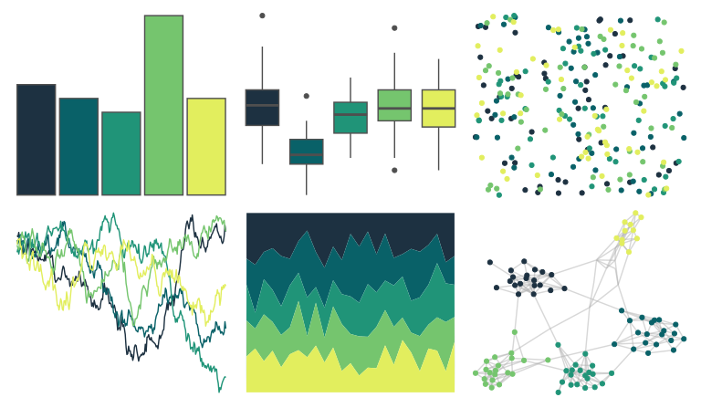

# MapPalettes - green_machine 

::: columns
::: {.column width="50%"}

**Github**

[disarm-platform/MapPalettes](https://github.com/disarm-platform/MapPalettes)
:::

::: {.column width="50%"}

**CRAN**

Not on CRAN
:::
:::

<hr> 

Use with [paletteer](https://emilhvitfeldt.github.io/paletteer/) package:

```r
library(paletteer)
paletteer_d("MapPalettes::green_machine")
```

Use raw:

```r
c("#1D3141FF", "#096168FF", "#209478FF", "#75C56EFF", "#E2EE5EFF")
``` 

 

<br>

# Related Palettes

<div class="list" style="display: grid; grid-template-columns: auto auto auto;"> <figure class="figure">
<a href="../../awtools/a_palette/"> </a>
</figure> <figure class="figure">
<a href="../../fishualize/Elagatis_bipinnulata/"> </a>
</figure> <figure class="figure">
<a href="../../rcartocolor/ag_GrnYl/"> </a>
</figure> <figure class="figure">
<a href="../../rcartocolor/Emrld/"> </a>
</figure> <figure class="figure">
<a href="../../ggprism/viridis/"> </a>
</figure> <figure class="figure">
<a href="../../LaCroixColoR/Lime/"> </a>
</figure> <figure class="figure">
<a href="../../MetBrewer/Hokusai3/"> </a>
</figure> <figure class="figure">
<a href="../../beyonce/X22/"> </a>
</figure> <figure class="figure">
<a href="../../rcartocolor/BluYl/"> </a>
</figure> <figure class="figure">
<a href="../../NatParksPalettes/Denali/"> </a>
</figure> <figure class="figure">
<a href="../../fishualize/Pomacanthus_xanthometopon/"> </a>
</figure> <figure class="figure">
<a href="../../rtist/vangogh/"> </a>
</figure> 
</div>
