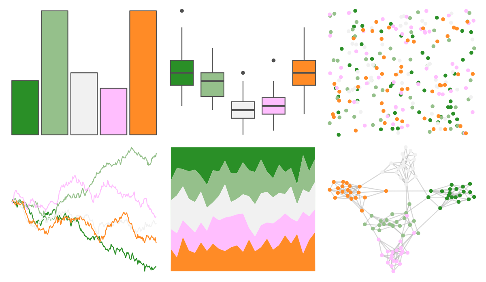

# MapPalettes - irish_flag 

::: columns
::: {.column width="50%"}

**Github**

[disarm-platform/MapPalettes](https://github.com/disarm-platform/MapPalettes)
:::

::: {.column width="50%"}

**CRAN**

Not on CRAN
:::
:::

<hr> 

Use with [paletteer](https://emilhvitfeldt.github.io/paletteer/) package:

```r
library(paletteer)
paletteer_d("MapPalettes::irish_flag")
```

Use raw:

```r
c("#2A8F27FF", "#95C08BFF", "#F1F1F1FF", "#FFBEFEFF", "#FF8B26FF")
``` 

 

<br>

# Related Palettes

<div class="list" style="display: grid; grid-template-columns: auto auto auto;"> <figure class="figure">
<a href="../../awtools/a_palette/"> </a>
</figure> <figure class="figure">
<a href="../../ButterflyColors/hamadryas_feronia/"> </a>
</figure> <figure class="figure">
<a href="../../ButterflyColors/hamadryas_feronia/"> </a>
</figure> <figure class="figure">
<a href="../../MapPalettes/sunset/"> </a>
</figure> <figure class="figure">
<a href="../../khroma/light/"> </a>
</figure> <figure class="figure">
<a href="../../rcartocolor/Temps/"> </a>
</figure> <figure class="figure">
<a href="../../werpals/pan/"> </a>
</figure> <figure class="figure">
<a href="../../trekcolors/ferengi/"> </a>
</figure> <figure class="figure">
<a href="../../nationalparkcolors/Zion/"> </a>
</figure> <figure class="figure">
<a href="../../ButterflyColors/anteos_clorinde/"> </a>
</figure> <figure class="figure">
<a href="../../waRhol/camo_87_5/"> </a>
</figure> <figure class="figure">
<a href="../../Redmonder/qMSOPap/"> </a>
</figure> 
</div>
