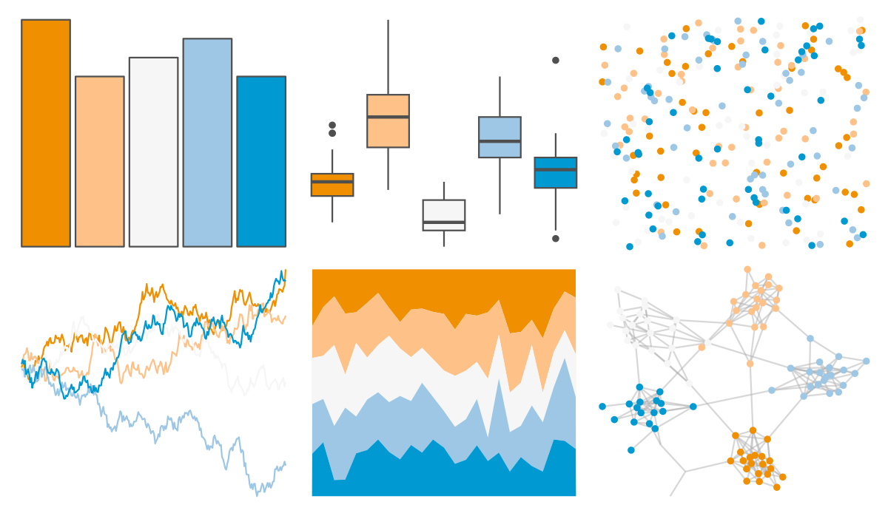

# MapPalettes - sunset 

::: columns
::: {.column width="50%"}

**Github**

[disarm-platform/MapPalettes](https://github.com/disarm-platform/MapPalettes)
:::

::: {.column width="50%"}

**CRAN**

Not on CRAN
:::
:::

<hr> 

Use with [paletteer](https://emilhvitfeldt.github.io/paletteer/) package:

```r
library(paletteer)
paletteer_d("MapPalettes::sunset")
```

Use raw:

```r
c("#F09000FF", "#FEC289FF", "#F6F6F6FF", "#9DC7E4FF", "#0099D1FF")
``` 

 

<br>

# Related Palettes

<div class="list" style="display: grid; grid-template-columns: auto auto auto;"> <figure class="figure">
<a href="../../awtools/a_palette/"> </a>
</figure> <figure class="figure">
<a href="../../beyonce/X9/"> </a>
</figure> <figure class="figure">
<a href="../../rcartocolor/Geyser/"> </a>
</figure> <figure class="figure">
<a href="../../colRoz/desert_sunset/"> </a>
</figure> <figure class="figure">
<a href="../../NineteenEightyR/miami1/"> </a>
</figure> <figure class="figure">
<a href="../../wesanderson/Chevalier1/"> </a>
</figure> <figure class="figure">
<a href="../../beyonce/X28/"> </a>
</figure> <figure class="figure">
<a href="../../nbapalettes/spurs/"> </a>
</figure> <figure class="figure">
<a href="../../wesanderson/Royal2/"> </a>
</figure> <figure class="figure">
<a href="../../nationalparkcolors/MtRainier/"> </a>
</figure> <figure class="figure">
<a href="../../fishualize/Xyrichthys_novacula/"> </a>
</figure> <figure class="figure">
<a href="../../MapPalettes/irish_flag/"> </a>
</figure> 
</div>
