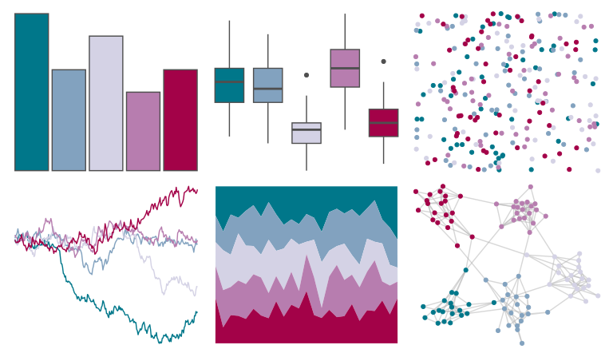

# MapPalettes - tealberry_pie 

::: columns
::: {.column width="50%"}

**Github**

[disarm-platform/MapPalettes](https://github.com/disarm-platform/MapPalettes)
:::

::: {.column width="50%"}

**CRAN**

Not on CRAN
:::
:::

<hr> 

Use with [paletteer](https://emilhvitfeldt.github.io/paletteer/) package:

```r
library(paletteer)
paletteer_d("MapPalettes::tealberry_pie")
```

Use raw:

```r
c("#00778AFF", "#82A2BFFF", "#D4D2E5FF", "#B77DAFFF", "#A30248FF")
``` 

 

<br>

# Related Palettes

<div class="list" style="display: grid; grid-template-columns: auto auto auto;"> <figure class="figure">
<a href="../../awtools/a_palette/"> </a>
</figure> <figure class="figure">
<a href="../../beyonce/X51/"> </a>
</figure> <figure class="figure">
<a href="../../LaCroixColoR/Berry/"> </a>
</figure> <figure class="figure">
<a href="../../beyonce/X49/"> </a>
</figure> <figure class="figure">
<a href="../../nbapalettes/hornets2/"> </a>
</figure> <figure class="figure">
<a href="../../fishualize/Scarus_globiceps/"> </a>
</figure> <figure class="figure">
<a href="../../nbapalettes/hornets_city2/"> </a>
</figure> <figure class="figure">
<a href="../../feathers/galah/"> </a>
</figure> <figure class="figure">
<a href="../../nbapalettes/sixers_city/"> </a>
</figure> <figure class="figure">
<a href="../../fishualize/Sparisoma_tuyupiranga_m/"> </a>
</figure> <figure class="figure">
<a href="../../vapoRwave/avanti/"> </a>
</figure> <figure class="figure">
<a href="../../nbapalettes/wizards_earned/"> </a>
</figure> 
</div>
