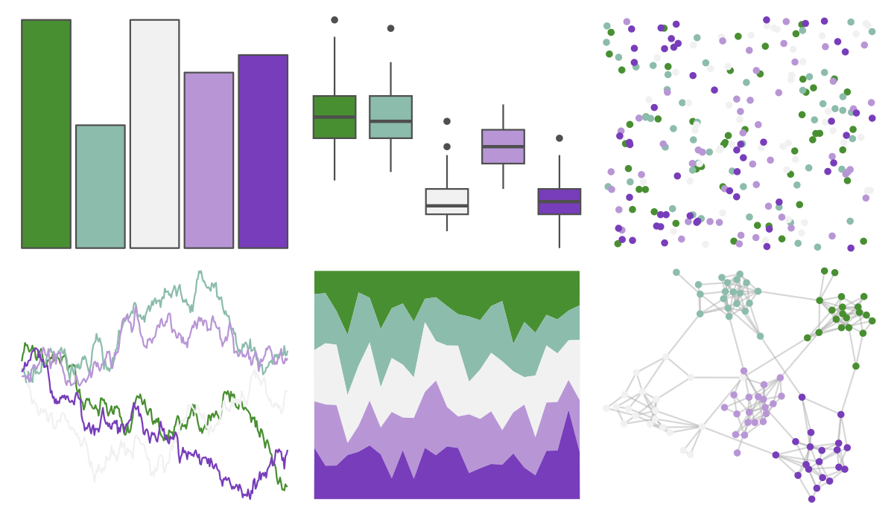

# MapPalettes - the_joker 

::: columns
::: {.column width="50%"}

**Github**

[disarm-platform/MapPalettes](https://github.com/disarm-platform/MapPalettes)
:::

::: {.column width="50%"}

**CRAN**

Not on CRAN
:::
:::

<hr> 

Use with [paletteer](https://emilhvitfeldt.github.io/paletteer/) package:

```r
library(paletteer)
paletteer_d("MapPalettes::the_joker")
```

Use raw:

```r
c("#488F31FF", "#8CBCACFF", "#F1F1F1FF", "#B896D6FF", "#783DBAFF")
``` 

 

<br>

# Related Palettes

<div class="list" style="display: grid; grid-template-columns: auto auto auto;"> <figure class="figure">
<a href="../../awtools/a_palette/"> </a>
</figure> <figure class="figure">
<a href="../../ButterflyColors/hamadryas_feronia/"> </a>
</figure> <figure class="figure">
<a href="../../ButterflyColors/hamadryas_feronia/"> </a>
</figure> <figure class="figure">
<a href="../../khroma/PRGn/"> </a>
</figure> <figure class="figure">
<a href="../../calecopal/lupinus/"> </a>
</figure> <figure class="figure">
<a href="../../vangogh/Landscape/"> </a>
</figure> <figure class="figure">
<a href="../../ggprism/waves2/"> </a>
</figure> <figure class="figure">
<a href="../../nationalparkcolors/GrandTeton/"> </a>
</figure> <figure class="figure">
<a href="../../beyonce/X101/"> </a>
</figure> <figure class="figure">
<a href="../../fishualize/Opisthonema_oglinum/"> </a>
</figure> <figure class="figure">
<a href="../../nord/silver_mine/"> </a>
</figure> <figure class="figure">
<a href="../../MetBrewer/Monet/"> </a>
</figure> 
</div>
