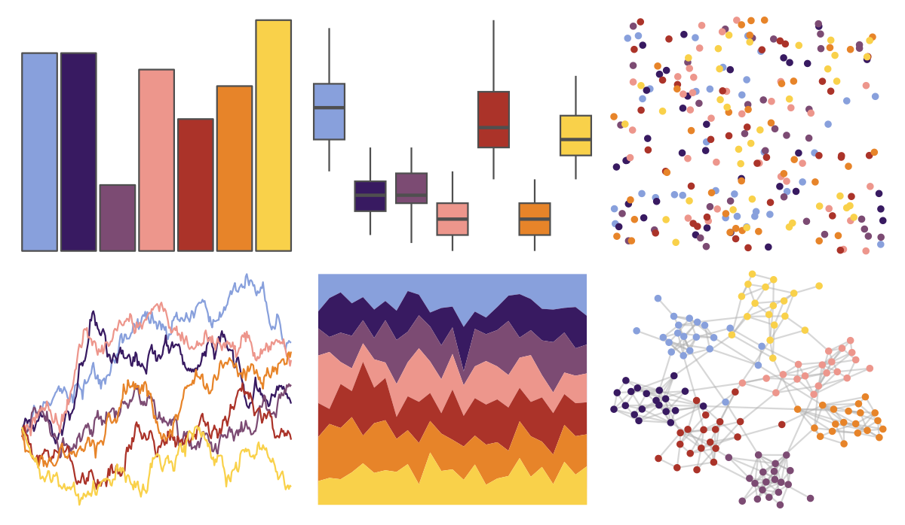

# MetBrewer - Archambault 

::: columns
::: {.column width="50%"}

**Github**

[BlakeRMills/MetBrewer](https://github.com/BlakeRMills/MetBrewer)
:::

::: {.column width="50%"}

**CRAN**

[MetBrewer](https://CRAN.R-project.org/package=MetBrewer)
:::
:::

<hr> 

Use with [paletteer](https://emilhvitfeldt.github.io/paletteer/) package:

```r
library(paletteer)
paletteer_d("MetBrewer::Archambault")
```

Use raw:

```r
c("#88A0DCFF", "#381A61FF", "#7C4B73FF", "#ED968CFF", "#AB3329FF", "#E78429FF", "#F9D14AFF")
``` 

 

<br>

# Related Palettes

<div class="list" style="display: grid; grid-template-columns: auto auto auto;"> <figure class="figure">
<a href="../../awtools/a_palette/"> </a>
</figure> <figure class="figure">
<a href="../../jcolors/pal4/"> </a>
</figure> <figure class="figure">
<a href="../../futurevisions/cancri/"> </a>
</figure> <figure class="figure">
<a href="../../nationalparkcolors/DeathValley/"> </a>
</figure> <figure class="figure">
<a href="../../ghibli/MononokeMedium/"> </a>
</figure> <figure class="figure">
<a href="../../ggsci/default_nejm/"> </a>
</figure> <figure class="figure">
<a href="../../lisa/EdvardMunch/"> </a>
</figure> <figure class="figure">
<a href="../../NineteenEightyR/sunset1/"> </a>
</figure> <figure class="figure">
<a href="../../MetBrewer/Cross/"> </a>
</figure> <figure class="figure">
<a href="../../fishualize/Pronotogrammus_martinicensis/"> </a>
</figure> <figure class="figure">
<a href="../../MetBrewer/Tam/"> </a>
</figure> <figure class="figure">
<a href="../../peRReo/badbunny2/"> </a>
</figure> 
</div>
