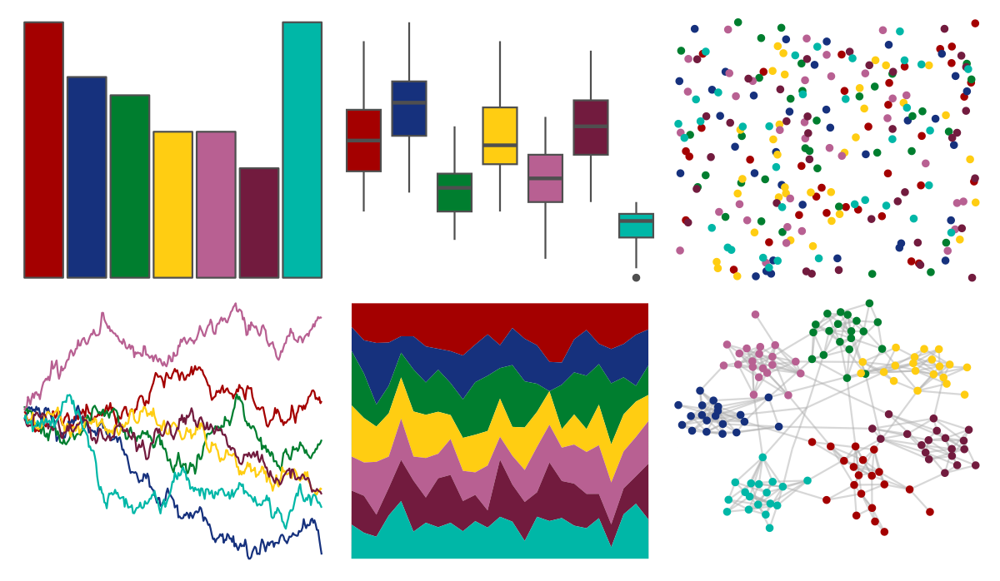

# MetBrewer - Austria 

::: columns
::: {.column width="50%"}

**Github**

[BlakeRMills/MetBrewer](https://github.com/BlakeRMills/MetBrewer)
:::

::: {.column width="50%"}

**CRAN**

[MetBrewer](https://CRAN.R-project.org/package=MetBrewer)
:::
:::

<hr> 

Use with [paletteer](https://emilhvitfeldt.github.io/paletteer/) package:

```r
library(paletteer)
paletteer_d("MetBrewer::Austria")
```

Use raw:

```r
c("#A40000FF", "#16317DFF", "#007E2FFF", "#FFCD12FF", "#B86092FF", "#721B3EFF", "#00B7A7FF")
``` 

 

<br>

# Related Palettes

<div class="list" style="display: grid; grid-template-columns: auto auto auto;"> <figure class="figure">
<a href="../../awtools/a_palette/"> </a>
</figure> <figure class="figure">
<a href="../../beyonce/X18/"> </a>
</figure> <figure class="figure">
<a href="../../LaCroixColoR/PassionFruit/"> </a>
</figure> <figure class="figure">
<a href="../../khroma/muted/"> </a>
</figure> <figure class="figure">
<a href="../../pals/tol/"> </a>
</figure> <figure class="figure">
<a href="../../tvthemes/Steven/"> </a>
</figure> <figure class="figure">
<a href="../../ggthemes/excel_Slice/"> </a>
</figure> <figure class="figure">
<a href="../../nbapalettes/timberwolves_classic/"> </a>
</figure> <figure class="figure">
<a href="../../jcolors/pal5/"> </a>
</figure> <figure class="figure">
<a href="../../nbapalettes/mavericks_banner/"> </a>
</figure> <figure class="figure">
<a href="../../vapoRwave/hyperBubble/"> </a>
</figure> <figure class="figure">
<a href="../../MetBrewer/Tsimshian/"> </a>
</figure> 
</div>
