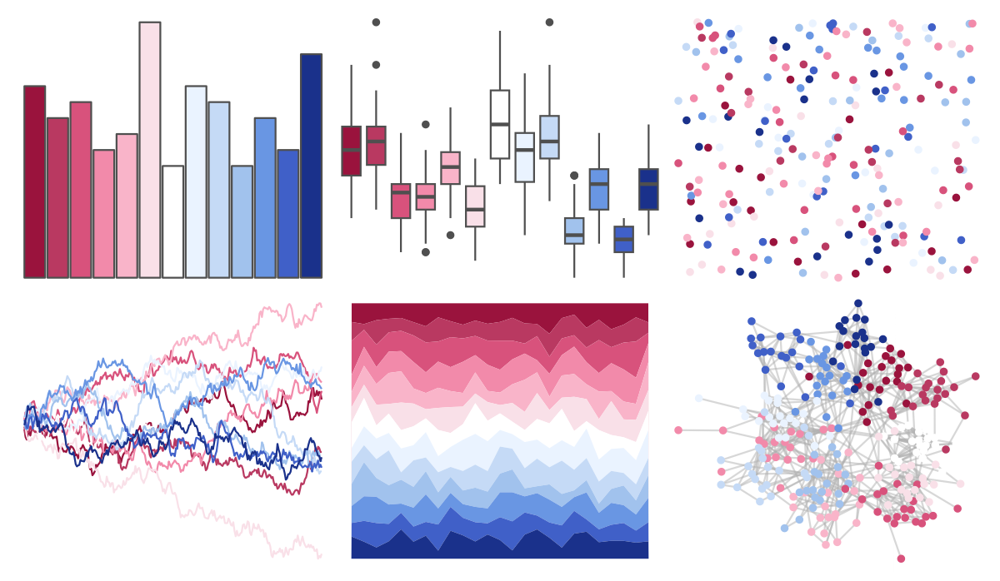

# MetBrewer - Benedictus 

::: columns
::: {.column width="50%"}

**Github**

[BlakeRMills/MetBrewer](https://github.com/BlakeRMills/MetBrewer)
:::

::: {.column width="50%"}

**CRAN**

[MetBrewer](https://CRAN.R-project.org/package=MetBrewer)
:::
:::

<hr> 

Use with [paletteer](https://emilhvitfeldt.github.io/paletteer/) package:

```r
library(paletteer)
paletteer_d("MetBrewer::Benedictus")
```

Use raw:

```r
c("#9A133DFF", "#B93961FF", "#D8527CFF", "#F28AAAFF", "#F9B4C9FF", "#F9E0E8FF", "#FFFFFFFF", "#EAF3FFFF", "#C5DAF6FF", "#A1C2EDFF", "#6996E3FF", "#4060C8FF", "#1A318BFF")
``` 

 

<br>

# Related Palettes

<div class="list" style="display: grid; grid-template-columns: auto auto auto;"> <figure class="figure">
<a href="../../amerika/Dem_Ind_Rep3/"> </a>
</figure> <figure class="figure">
<a href="../../palettetown/articuno/"> </a>
</figure> <figure class="figure">
<a href="../../palettetown/zubat/"> </a>
</figure> <figure class="figure">
<a href="../../palettetown/togetic/"> </a>
</figure> <figure class="figure">
<a href="../../unikn/pal_unikn_pair/"> </a>
</figure> <figure class="figure">
<a href="../../palettetown/nidoranm/"> </a>
</figure> <figure class="figure">
<a href="../../palettetown/forretress/"> </a>
</figure> <figure class="figure">
<a href="../../Redmonder/dPBIRdBu/"> </a>
</figure> <figure class="figure">
<a href="../../palettetown/metagross/"> </a>
</figure> <figure class="figure">
<a href="../../palettetown/metang/"> </a>
</figure> <figure class="figure">
<a href="../../palettetown/latios/"> </a>
</figure> <figure class="figure">
<a href="../../ggthemes/Classic_Purple_Gray_12/"> </a>
</figure> 
</div>
