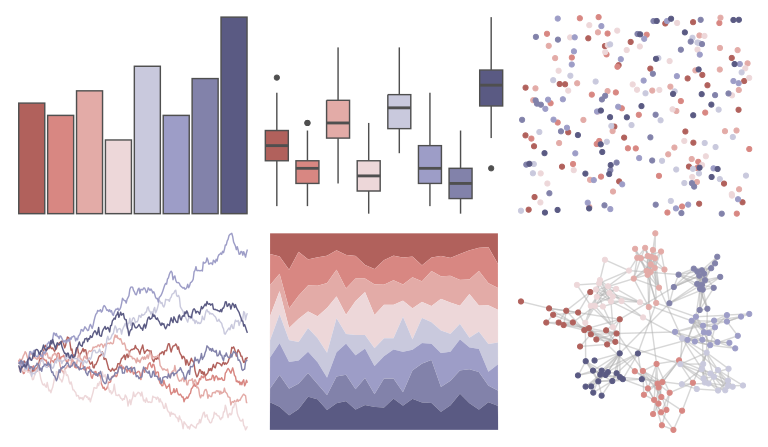

# MetBrewer - Cassatt1 

::: columns
::: {.column width="50%"}

**Github**

[BlakeRMills/MetBrewer](https://github.com/BlakeRMills/MetBrewer)
:::

::: {.column width="50%"}

**CRAN**

[MetBrewer](https://CRAN.R-project.org/package=MetBrewer)
:::
:::

<hr> 

Use with [paletteer](https://emilhvitfeldt.github.io/paletteer/) package:

```r
library(paletteer)
paletteer_d("MetBrewer::Cassatt1")
```

Use raw:

```r
c("#B1615CFF", "#D88782FF", "#E3ABA7FF", "#EDD7D9FF", "#C9C9DDFF", "#9D9DC7FF", "#8282AAFF", "#5A5A83FF")
``` 

 

<br>

# Related Palettes

<div class="list" style="display: grid; grid-template-columns: auto auto auto;"> <figure class="figure">
<a href="../../awtools/a_palette/"> </a>
</figure> <figure class="figure">
<a href="../../beyonce/X90/"> </a>
</figure> <figure class="figure">
<a href="../../beyonce/X126/"> </a>
</figure> <figure class="figure">
<a href="../../beyonce/X60/"> </a>
</figure> <figure class="figure">
<a href="../../MetBrewer/Monet/"> </a>
</figure> <figure class="figure">
<a href="../../fishualize/Mycteroperca_bonaci/"> </a>
</figure> <figure class="figure">
<a href="../../feathers/galah/"> </a>
</figure> <figure class="figure">
<a href="../../tayloRswift/taylor1989/"> </a>
</figure> <figure class="figure">
<a href="../../nord/halifax_harbor/"> </a>
</figure> <figure class="figure">
<a href="../../ochRe/williams_pilbara/"> </a>
</figure> <figure class="figure">
<a href="../../Redmonder/sPBIRd/"> </a>
</figure> <figure class="figure">
<a href="../../palettetown/muk/"> </a>
</figure> 
</div>
