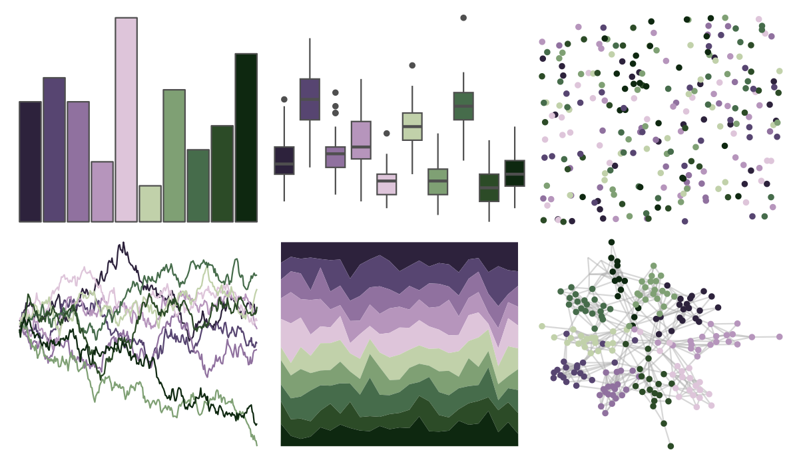

# MetBrewer - Cassatt2 

::: columns
::: {.column width="50%"}

**Github**

[BlakeRMills/MetBrewer](https://github.com/BlakeRMills/MetBrewer)
:::

::: {.column width="50%"}

**CRAN**

[MetBrewer](https://CRAN.R-project.org/package=MetBrewer)
:::
:::

<hr> 

Use with [paletteer](https://emilhvitfeldt.github.io/paletteer/) package:

```r
library(paletteer)
paletteer_d("MetBrewer::Cassatt2")
```

Use raw:

```r
c("#2D223CFF", "#574571FF", "#90719FFF", "#B695BCFF", "#DEC5DAFF", "#C1D1AAFF", "#7FA074FF", "#466C4BFF", "#2C4B27FF", "#0E2810FF")
``` 

 

<br>

# Related Palettes

<div class="list" style="display: grid; grid-template-columns: auto auto auto;"> <figure class="figure">
<a href="../../amerika/Dem_Ind_Rep3/"> </a>
</figure> <figure class="figure">
<a href="../../beyonce/X125/"> </a>
</figure> <figure class="figure">
<a href="../../MoMAColors/Ernst/"> </a>
</figure> <figure class="figure">
<a href="../../beyonce/X10/"> </a>
</figure> <figure class="figure">
<a href="../../MexBrewer/Frida/"> </a>
</figure> <figure class="figure">
<a href="../../vapoRwave/seaPunk/"> </a>
</figure> <figure class="figure">
<a href="../../ghibli/LaputaMedium/"> </a>
</figure> <figure class="figure">
<a href="../../impressionist.colors/les_nympheas_2/"> </a>
</figure> <figure class="figure">
<a href="../../colRoz/salt_lake/"> </a>
</figure> <figure class="figure">
<a href="../../ghibli/YesterdayMedium/"> </a>
</figure> <figure class="figure">
<a href="../../beyonce/X7/"> </a>
</figure> <figure class="figure">
<a href="../../vapeplot/seapunk/"> </a>
</figure> 
</div>
