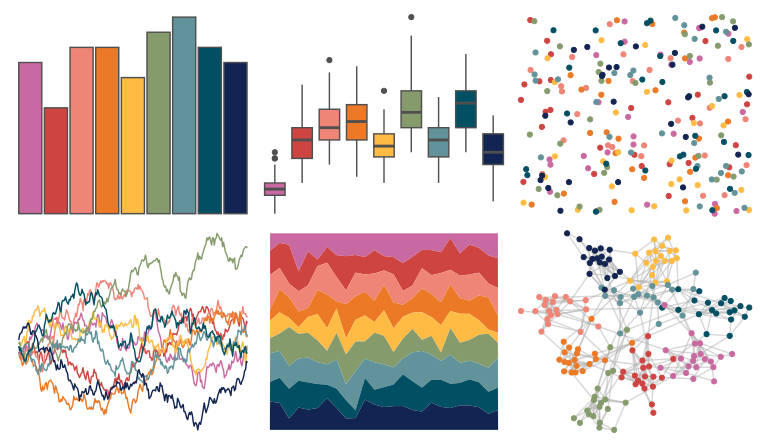

# MetBrewer - Cross 

::: columns
::: {.column width="50%"}

**Github**

[BlakeRMills/MetBrewer](https://github.com/BlakeRMills/MetBrewer)
:::

::: {.column width="50%"}

**CRAN**

[MetBrewer](https://CRAN.R-project.org/package=MetBrewer)
:::
:::

<hr> 

Use with [paletteer](https://emilhvitfeldt.github.io/paletteer/) package:

```r
library(paletteer)
paletteer_d("MetBrewer::Cross")
```

Use raw:

```r
c("#C969A1FF", "#CE4441FF", "#EE8577FF", "#EB7926FF", "#FFBB44FF", "#859B6CFF", "#62929AFF", "#004F63FF", "#122451FF")
``` 

 

<br>

# Related Palettes

<div class="list" style="display: grid; grid-template-columns: auto auto auto;"> <figure class="figure">
<a href="../../awtools/a_palette/"> </a>
</figure> <figure class="figure">
<a href="../../ggsci/default_nejm/"> </a>
</figure> <figure class="figure">
<a href="../../rcartocolor/Bold/"> </a>
</figure> <figure class="figure">
<a href="../../khroma/vibrant/"> </a>
</figure> <figure class="figure">
<a href="../../MetBrewer/Renoir/"> </a>
</figure> <figure class="figure">
<a href="../../tvthemes/Sunstone/"> </a>
</figure> <figure class="figure">
<a href="../../MetBrewer/Redon/"> </a>
</figure> <figure class="figure">
<a href="../../basetheme/royal/"> </a>
</figure> <figure class="figure">
<a href="../../MetBrewer/Archambault/"> </a>
</figure> <figure class="figure">
<a href="../../palettetown/starmie/"> </a>
</figure> <figure class="figure">
<a href="../../Redmonder/qPBI/"> </a>
</figure> <figure class="figure">
<a href="../../DresdenColor/paired/"> </a>
</figure> 
</div>
