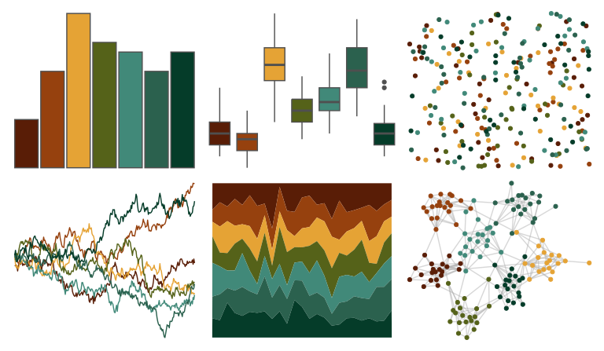

# MetBrewer - Degas 

::: columns
::: {.column width="50%"}

**Github**

[BlakeRMills/MetBrewer](https://github.com/BlakeRMills/MetBrewer)
:::

::: {.column width="50%"}

**CRAN**

[MetBrewer](https://CRAN.R-project.org/package=MetBrewer)
:::
:::

<hr> 

Use with [paletteer](https://emilhvitfeldt.github.io/paletteer/) package:

```r
library(paletteer)
paletteer_d("MetBrewer::Degas")
```

Use raw:

```r
c("#591D06FF", "#96410EFF", "#E5A335FF", "#556219FF", "#418979FF", "#2B614EFF", "#053C29FF")
``` 

 

<br>

# Related Palettes

<div class="list" style="display: grid; grid-template-columns: auto auto auto;"> <figure class="figure">
<a href="../../awtools/a_palette/"> </a>
</figure> <figure class="figure">
<a href="../../lisa/ClaudeMonet/"> </a>
</figure> <figure class="figure">
<a href="../../MetBrewer/Nattier/"> </a>
</figure> <figure class="figure">
<a href="../../Manu/Pohutukawa/"> </a>
</figure> <figure class="figure">
<a href="../../fishualize/Anisotremus_virginicus/"> </a>
</figure> <figure class="figure">
<a href="../../MetBrewer/Isfahan1/"> </a>
</figure> <figure class="figure">
<a href="../../MetBrewer/Gauguin/"> </a>
</figure> <figure class="figure">
<a href="../../DresdenColor/turncoat/"> </a>
</figure> <figure class="figure">
<a href="../../wesanderson/Cavalcanti1/"> </a>
</figure> <figure class="figure">
<a href="../../DresdenColor/bloodrites/"> </a>
</figure> <figure class="figure">
<a href="../../colRoz/xantho/"> </a>
</figure> <figure class="figure">
<a href="../../fishualize/Serranus_baldwini/"> </a>
</figure> 
</div>
