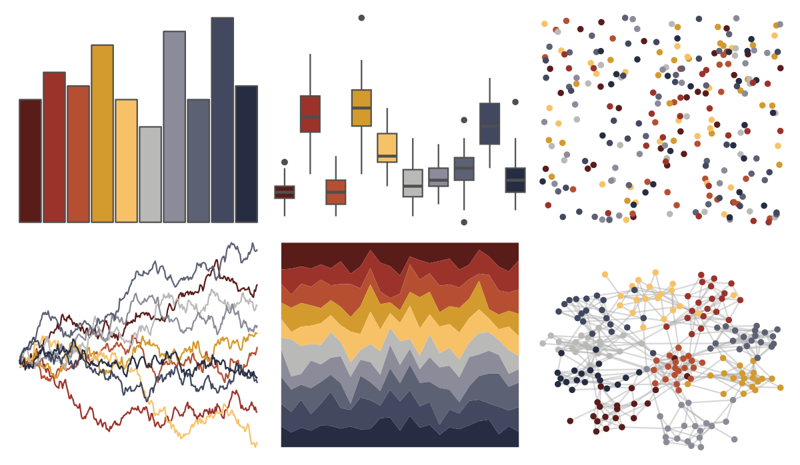
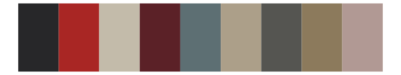

# MetBrewer - Demuth 

::: columns
::: {.column width="50%"}

**Github**

[BlakeRMills/MetBrewer](https://github.com/BlakeRMills/MetBrewer)
:::

::: {.column width="50%"}

**CRAN**

[MetBrewer](https://CRAN.R-project.org/package=MetBrewer)
:::
:::

<hr> 

Use with [paletteer](https://emilhvitfeldt.github.io/paletteer/) package:

```r
library(paletteer)
paletteer_d("MetBrewer::Demuth")
```

Use raw:

```r
c("#591C19FF", "#9B332BFF", "#B64F32FF", "#D39A2DFF", "#F7C267FF", "#B9B9B8FF", "#8B8B99FF", "#5D6174FF", "#41485FFF", "#262D42FF")
``` 

 

<br>

# Related Palettes

<div class="list" style="display: grid; grid-template-columns: auto auto auto;"> <figure class="figure">
<a href="../../awtools/a_palette/"> </a>
</figure> <figure class="figure">
<a href="../../futurevisions/pegasi/"> </a>
</figure> <figure class="figure">
<a href="../../MetBrewer/Redon/"> </a>
</figure> <figure class="figure">
<a href="../../NatParksPalettes/Torres/"> </a>
</figure> <figure class="figure">
<a href="../../nbapalettes/thunder_city/"> </a>
</figure> <figure class="figure">
<a href="../../ggthemr/light/"> </a>
</figure> <figure class="figure">
<a href="../../peRReo/wyy/"> </a>
</figure> <figure class="figure">
<a href="../../nord/red_mountain/"> </a>
</figure> <figure class="figure">
<a href="../../ggsci/default_jco/"> </a>
</figure> <figure class="figure">
<a href="../../ghibli/PonyoMedium/"> </a>
</figure> <figure class="figure">
<a href="../../dutchmasters/milkmaid/"> </a>
</figure> <figure class="figure">
<a href="../../MetBrewer/Tiepolo/"> </a>
</figure> 
</div>
