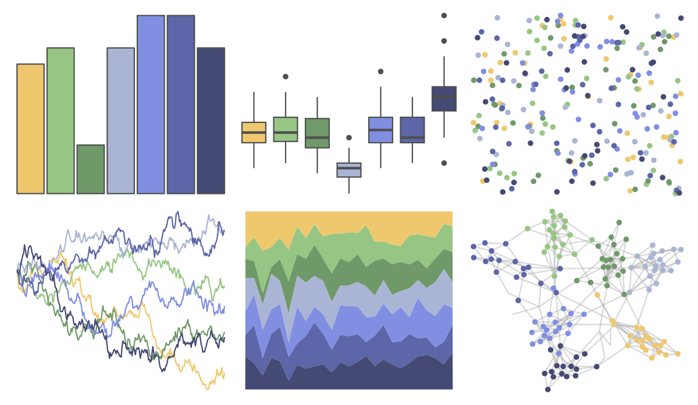

# MetBrewer - Derain 

::: columns
::: {.column width="50%"}

**Github**

[BlakeRMills/MetBrewer](https://github.com/BlakeRMills/MetBrewer)
:::

::: {.column width="50%"}

**CRAN**

[MetBrewer](https://CRAN.R-project.org/package=MetBrewer)
:::
:::

<hr> 

Use with [paletteer](https://emilhvitfeldt.github.io/paletteer/) package:

```r
library(paletteer)
paletteer_d("MetBrewer::Derain")
```

Use raw:

```r
c("#EFC86EFF", "#97C684FF", "#6F9969FF", "#AAB5D5FF", "#808FE1FF", "#5C66A8FF", "#454A74FF")
``` 

 

<br>

# Related Palettes

<div class="list" style="display: grid; grid-template-columns: auto auto auto;"> <figure class="figure">
<a href="../../amerika/Dem_Ind_Rep3/"> </a>
</figure> <figure class="figure">
<a href="../../fishualize/Thunnus_obesus/"> </a>
</figure> <figure class="figure">
<a href="../../calecopal/sierra2/"> </a>
</figure> <figure class="figure">
<a href="../../vangogh/Irises/"> </a>
</figure> <figure class="figure">
<a href="../../nationalparkcolors/GreatBasin/"> </a>
</figure> <figure class="figure">
<a href="../../Manu/Kotare/"> </a>
</figure> <figure class="figure">
<a href="../../lisa/ClaudeMonet_2/"> </a>
</figure> <figure class="figure">
<a href="../../colRoz/c_decresii/"> </a>
</figure> <figure class="figure">
<a href="../../calecopal/bigsur/"> </a>
</figure> <figure class="figure">
<a href="../../IslamicArt/jerusalem/"> </a>
</figure> <figure class="figure">
<a href="../../MoMAColors/Rattner/"> </a>
</figure> <figure class="figure">
<a href="../../calecopal/bigsur2/"> </a>
</figure> 
</div>
