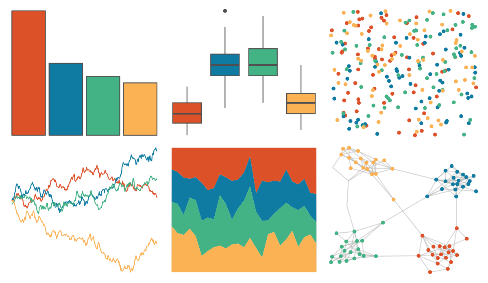

# MetBrewer - Egypt 

::: columns
::: {.column width="50%"}

**Github**

[BlakeRMills/MetBrewer](https://github.com/BlakeRMills/MetBrewer)
:::

::: {.column width="50%"}

**CRAN**

[MetBrewer](https://CRAN.R-project.org/package=MetBrewer)
:::
:::

<hr> 

Use with [paletteer](https://emilhvitfeldt.github.io/paletteer/) package:

```r
library(paletteer)
paletteer_d("MetBrewer::Egypt")
```

Use raw:

```r
c("#DD5129FF", "#0F7BA2FF", "#43B284FF", "#FAB255FF")
``` 

 

<br>

# Related Palettes

<div class="list" style="display: grid; grid-template-columns: auto auto auto;"> <figure class="figure">
<a href="../../awtools/a_palette/"> </a>
</figure> <figure class="figure">
<a href="../../fishualize/Etheostoma_spectabile/"> </a>
</figure> <figure class="figure">
<a href="../../rockthemes/nodoubt/"> </a>
</figure> <figure class="figure">
<a href="../../LaCroixColoR/PeachPear/"> </a>
</figure> <figure class="figure">
<a href="../../fishualize/Epibulus_insidiator/"> </a>
</figure> <figure class="figure">
<a href="../../yarrr/google/"> </a>
</figure> <figure class="figure">
<a href="../../ggthemes/excel_Organic/"> </a>
</figure> <figure class="figure">
<a href="../../suffrager/CarolMan/"> </a>
</figure> <figure class="figure">
<a href="../../yarrr/nemo/"> </a>
</figure> <figure class="figure">
<a href="../../lisa/PabloPicasso_1/"> </a>
</figure> <figure class="figure">
<a href="../../rtist/picasso/"> </a>
</figure> <figure class="figure">
<a href="../../nationalparkcolors/Badlands/"> </a>
</figure> 
</div>
