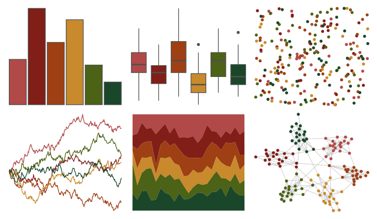

# MetBrewer - Gauguin 

::: columns
::: {.column width="50%"}

**Github**

[BlakeRMills/MetBrewer](https://github.com/BlakeRMills/MetBrewer)
:::

::: {.column width="50%"}

**CRAN**

[MetBrewer](https://CRAN.R-project.org/package=MetBrewer)
:::
:::

<hr> 

Use with [paletteer](https://emilhvitfeldt.github.io/paletteer/) package:

```r
library(paletteer)
paletteer_d("MetBrewer::Gauguin")
```

Use raw:

```r
c("#B04948FF", "#811E18FF", "#9E4013FF", "#C88A2CFF", "#4C6216FF", "#1A472AFF")
``` 

 

<br>

# Related Palettes

<div class="list" style="display: grid; grid-template-columns: auto auto auto;"> <figure class="figure">
<a href="../../awtools/a_palette/"> </a>
</figure> <figure class="figure">
<a href="../../MetBrewer/Nattier/"> </a>
</figure> <figure class="figure">
<a href="../../MetBrewer/Peru2/"> </a>
</figure> <figure class="figure">
<a href="../../nbapalettes/supersonics_90s/"> </a>
</figure> <figure class="figure">
<a href="../../yarrr/rat/"> </a>
</figure> <figure class="figure">
<a href="../../DresdenColor/turncoat/"> </a>
</figure> <figure class="figure">
<a href="../../MetBrewer/Degas/"> </a>
</figure> <figure class="figure">
<a href="../../fishualize/Pseudupeneus_maculatus/"> </a>
</figure> <figure class="figure">
<a href="../../colRoz/a_conica/"> </a>
</figure> <figure class="figure">
<a href="../../NineteenEightyR/sunset2/"> </a>
</figure> <figure class="figure">
<a href="../../ggprism/greenwash/"> </a>
</figure> <figure class="figure">
<a href="../../NatParksPalettes/Saguaro/"> </a>
</figure> 
</div>
