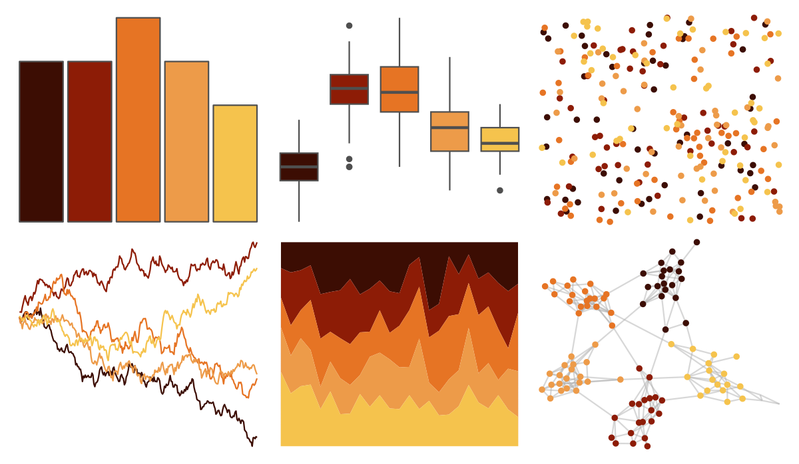

# MetBrewer - Greek 

::: columns
::: {.column width="50%"}

**Github**

[BlakeRMills/MetBrewer](https://github.com/BlakeRMills/MetBrewer)
:::

::: {.column width="50%"}

**CRAN**

[MetBrewer](https://CRAN.R-project.org/package=MetBrewer)
:::
:::

<hr> 

Use with [paletteer](https://emilhvitfeldt.github.io/paletteer/) package:

```r
library(paletteer)
paletteer_d("MetBrewer::Greek")
```

Use raw:

```r
c("#3C0D03FF", "#8D1C06FF", "#E67424FF", "#ED9B49FF", "#F5C34DFF")
``` 

 

<br>

# Related Palettes

<div class="list" style="display: grid; grid-template-columns: auto auto auto;"> <figure class="figure">
<a href="../../awtools/a_palette/"> </a>
</figure> <figure class="figure">
<a href="../../fishualize/Dermatolepis_inermis/"> </a>
</figure> <figure class="figure">
<a href="../../fishualize/Labrisomus_nuchipinnis/"> </a>
</figure> <figure class="figure">
<a href="../../soilpalettes/durorthod/"> </a>
</figure> <figure class="figure">
<a href="../../NineteenEightyR/seventies_aint_done_yet/"> </a>
</figure> <figure class="figure">
<a href="../../rockthemes/alice/"> </a>
</figure> <figure class="figure">
<a href="../../beyonce/X36/"> </a>
</figure> <figure class="figure">
<a href="../../nbapalettes/nuggets_city/"> </a>
</figure> <figure class="figure">
<a href="../../werpals/halong/"> </a>
</figure> <figure class="figure">
<a href="../../MetBrewer/Peru2/"> </a>
</figure> <figure class="figure">
<a href="../../beyonce/X45/"> </a>
</figure> <figure class="figure">
<a href="../../wesanderson/GrandBudapest1/"> </a>
</figure> 
</div>
