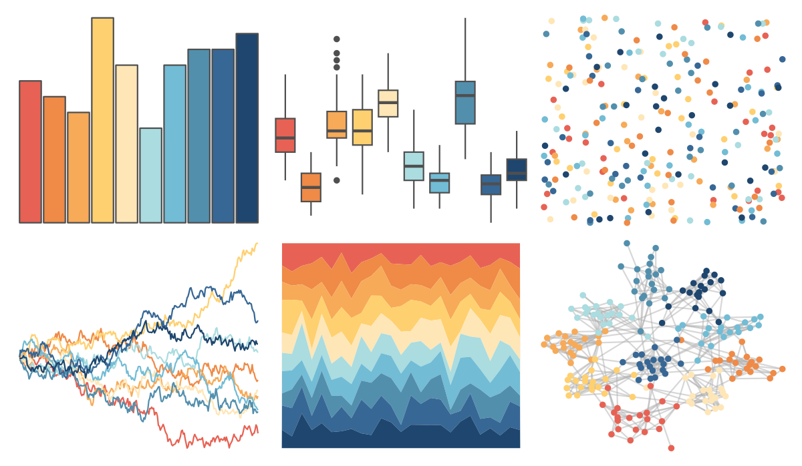

# MetBrewer - Hiroshige 

::: columns
::: {.column width="50%"}

**Github**

[BlakeRMills/MetBrewer](https://github.com/BlakeRMills/MetBrewer)
:::

::: {.column width="50%"}

**CRAN**

[MetBrewer](https://CRAN.R-project.org/package=MetBrewer)
:::
:::

<hr> 

Use with [paletteer](https://emilhvitfeldt.github.io/paletteer/) package:

```r
library(paletteer)
paletteer_d("MetBrewer::Hiroshige")
```

Use raw:

```r
c("#E76254FF", "#EF8A47FF", "#F7AA58FF", "#FFD06FFF", "#FFE6B7FF", "#AADCE0FF", "#72BCD5FF", "#528FADFF", "#376795FF", "#1E466EFF")
``` 

 

<br>

# Related Palettes

<div class="list" style="display: grid; grid-template-columns: auto auto auto;"> <figure class="figure">
<a href="../../awtools/a_palette/"> </a>
</figure> <figure class="figure">
<a href="../../khroma/sunset/"> </a>
</figure> <figure class="figure">
<a href="../../RColorBrewer/RdYlBu/"> </a>
</figure> <figure class="figure">
<a href="../../MetBrewer/VanGogh2/"> </a>
</figure> <figure class="figure">
<a href="../../trekcolors/lcars_nemesis/"> </a>
</figure> <figure class="figure">
<a href="../../colRoz/uluru/"> </a>
</figure> <figure class="figure">
<a href="../../palettetown/totodile/"> </a>
</figure> <figure class="figure">
<a href="../../RColorBrewer/Spectral/"> </a>
</figure> <figure class="figure">
<a href="../../tidyquant/tq_light/"> </a>
</figure> <figure class="figure">
<a href="../../NatParksPalettes/Yellowstone/"> </a>
</figure> <figure class="figure">
<a href="../../calecopal/figmtn/"> </a>
</figure> <figure class="figure">
<a href="../../Redmonder/qPBI/"> </a>
</figure> 
</div>
