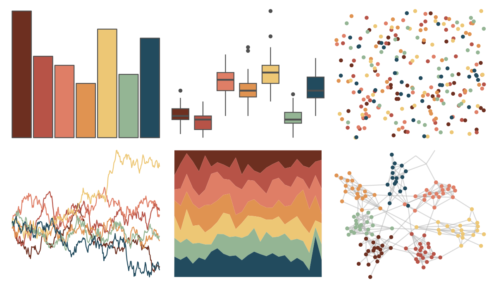

# MetBrewer - Hokusai1 

::: columns
::: {.column width="50%"}

**Github**

[BlakeRMills/MetBrewer](https://github.com/BlakeRMills/MetBrewer)
:::

::: {.column width="50%"}

**CRAN**

[MetBrewer](https://CRAN.R-project.org/package=MetBrewer)
:::
:::

<hr> 

Use with [paletteer](https://emilhvitfeldt.github.io/paletteer/) package:

```r
library(paletteer)
paletteer_d("MetBrewer::Hokusai1")
```

Use raw:

```r
c("#6D2F20FF", "#B75347FF", "#DF7E66FF", "#E09351FF", "#EDC775FF", "#94B594FF", "#224B5EFF")
``` 

 

<br>

# Related Palettes

<div class="list" style="display: grid; grid-template-columns: auto auto auto;"> <figure class="figure">
<a href="../../awtools/a_palette/"> </a>
</figure> <figure class="figure">
<a href="../../ghibli/PonyoMedium/"> </a>
</figure> <figure class="figure">
<a href="../../MetBrewer/Tiepolo/"> </a>
</figure> <figure class="figure">
<a href="../../colRoz/uluru/"> </a>
</figure> <figure class="figure">
<a href="../../lisa/RoyLichtenstein_2/"> </a>
</figure> <figure class="figure">
<a href="../../futurevisions/pegasi/"> </a>
</figure> <figure class="figure">
<a href="../../futurevisions/grand_tour/"> </a>
</figure> <figure class="figure">
<a href="../../PNWColors/Sunset/"> </a>
</figure> <figure class="figure">
<a href="../../MetBrewer/Nizami/"> </a>
</figure> <figure class="figure">
<a href="../../nationalparkcolors/DeathValley/"> </a>
</figure> <figure class="figure">
<a href="../../lisa/EdvardMunch_1/"> </a>
</figure> <figure class="figure">
<a href="../../NatParksPalettes/Torres/"> </a>
</figure> 
</div>
