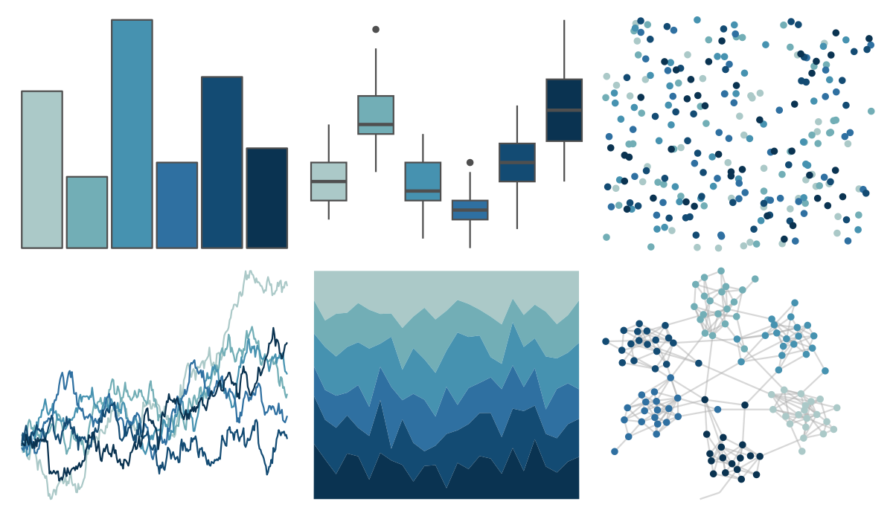
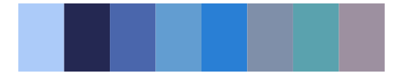

# MetBrewer - Hokusai2 

::: columns
::: {.column width="50%"}

**Github**

[BlakeRMills/MetBrewer](https://github.com/BlakeRMills/MetBrewer)
:::

::: {.column width="50%"}

**CRAN**

[MetBrewer](https://CRAN.R-project.org/package=MetBrewer)
:::
:::

<hr> 

Use with [paletteer](https://emilhvitfeldt.github.io/paletteer/) package:

```r
library(paletteer)
paletteer_d("MetBrewer::Hokusai2")
```

Use raw:

```r
c("#ABC9C8FF", "#72AEB6FF", "#4692B0FF", "#2F70A1FF", "#134B73FF", "#0A3351FF")
``` 

 

<br>

# Related Palettes

<div class="list" style="display: grid; grid-template-columns: auto auto auto;"> <figure class="figure">
<a href="../../awtools/a_palette/"> </a>
</figure> <figure class="figure">
<a href="../../MetBrewer/Pissaro/"> </a>
</figure> <figure class="figure">
<a href="../../rockthemes/coltrane/"> </a>
</figure> <figure class="figure">
<a href="../../severance/Dinner/"> </a>
</figure> <figure class="figure">
<a href="../../palettetown/pineco/"> </a>
</figure> <figure class="figure">
<a href="../../unikn/pal_petrol/"> </a>
</figure> <figure class="figure">
<a href="../../Redmonder/qMSOBuWarm/"> </a>
</figure> <figure class="figure">
<a href="../../lisa/GeorgiaOKeeffe/"> </a>
</figure> <figure class="figure">
<a href="../../rtist/okeeffe/"> </a>
</figure> <figure class="figure">
<a href="../../vapoRwave/jazzCup/"> </a>
</figure> <figure class="figure">
<a href="../../nbapalettes/hornets_city2/"> </a>
</figure> <figure class="figure">
<a href="../../vapeplot/jazzcup/"> </a>
</figure> 
</div>
