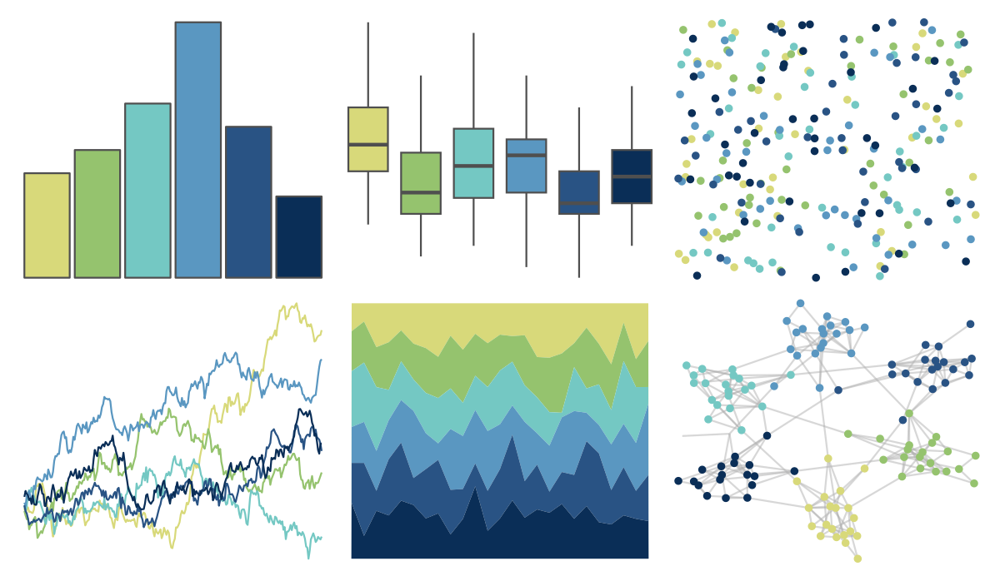
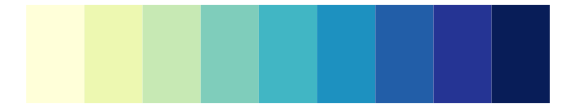

# MetBrewer - Hokusai3 

::: columns
::: {.column width="50%"}

**Github**

[BlakeRMills/MetBrewer](https://github.com/BlakeRMills/MetBrewer)
:::

::: {.column width="50%"}

**CRAN**

[MetBrewer](https://CRAN.R-project.org/package=MetBrewer)
:::
:::

<hr> 

Use with [paletteer](https://emilhvitfeldt.github.io/paletteer/) package:

```r
library(paletteer)
paletteer_d("MetBrewer::Hokusai3")
```

Use raw:

```r
c("#D8D97AFF", "#95C36EFF", "#74C8C3FF", "#5A97C1FF", "#295384FF", "#0A2E57FF")
``` 

 

<br>

# Related Palettes

<div class="list" style="display: grid; grid-template-columns: auto auto auto;"> <figure class="figure">
<a href="../../awtools/a_palette/"> </a>
</figure> <figure class="figure">
<a href="../../rcartocolor/Emrld/"> </a>
</figure> <figure class="figure">
<a href="../../LaCroixColoR/Lime/"> </a>
</figure> <figure class="figure">
<a href="../../RColorBrewer/YlGnBu/"> </a>
</figure> <figure class="figure">
<a href="../../MapPalettes/green_machine/"> </a>
</figure> <figure class="figure">
<a href="../../ghibli/YesterdayMedium/"> </a>
</figure> <figure class="figure">
<a href="../../fishualize/Rhinecanthus_aculeatus/"> </a>
</figure> <figure class="figure">
<a href="../../Redmonder/qMSOBu/"> </a>
</figure> <figure class="figure">
<a href="../../rcartocolor/BluYl/"> </a>
</figure> <figure class="figure">
<a href="../../NatParksPalettes/Denali/"> </a>
</figure> <figure class="figure">
<a href="../../ggprism/viridis/"> </a>
</figure> <figure class="figure">
<a href="../../lisa/VincentvanGogh/"> </a>
</figure> 
</div>
