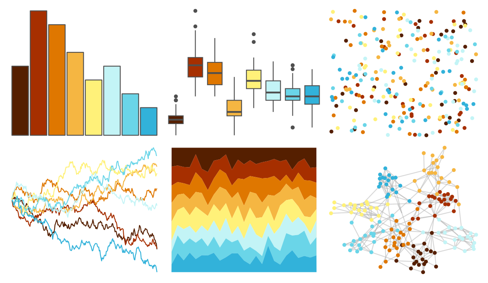

# MetBrewer - Homer1 

::: columns
::: {.column width="50%"}

**Github**

[BlakeRMills/MetBrewer](https://github.com/BlakeRMills/MetBrewer)
:::

::: {.column width="50%"}

**CRAN**

[MetBrewer](https://CRAN.R-project.org/package=MetBrewer)
:::
:::

<hr> 

Use with [paletteer](https://emilhvitfeldt.github.io/paletteer/) package:

```r
library(paletteer)
paletteer_d("MetBrewer::Homer1")
```

Use raw:

```r
c("#551F00FF", "#A62F00FF", "#DF7700FF", "#F5B642FF", "#FFF179FF", "#C3F4F6FF", "#6AD5E8FF", "#32B2DAFF")
``` 

 

<br>

# Related Palettes

<div class="list" style="display: grid; grid-template-columns: auto auto auto;"> <figure class="figure">
<a href="../../awtools/a_palette/"> </a>
</figure> <figure class="figure">
<a href="../../fishualize/Lepomis_megalotis/"> </a>
</figure> <figure class="figure">
<a href="../../ggthemes/Summer/"> </a>
</figure> <figure class="figure">
<a href="../../ggthemes/Classic_Traffic_Light/"> </a>
</figure> <figure class="figure">
<a href="../../RColorBrewer/RdYlGn/"> </a>
</figure> <figure class="figure">
<a href="../../fishualize/Parablennius_marmoreus/"> </a>
</figure> <figure class="figure">
<a href="../../DresdenColor/skingame/"> </a>
</figure> <figure class="figure">
<a href="../../ggthemes/Traffic/"> </a>
</figure> <figure class="figure">
<a href="../../colorBlindness/Brown2Blue10Steps/"> </a>
</figure> <figure class="figure">
<a href="../../wesanderson/Darjeeling1/"> </a>
</figure> <figure class="figure">
<a href="../../werpals/pan/"> </a>
</figure> <figure class="figure">
<a href="../../dichromat/BrowntoBlue_10/"> </a>
</figure> 
</div>
