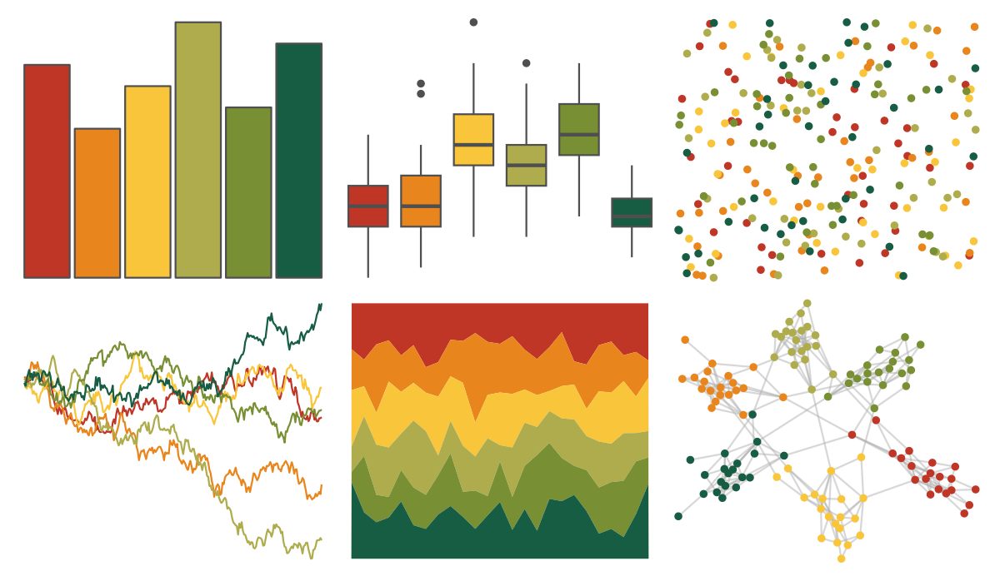

# MetBrewer - Homer2 

::: columns
::: {.column width="50%"}

**Github**

[BlakeRMills/MetBrewer](https://github.com/BlakeRMills/MetBrewer)
:::

::: {.column width="50%"}

**CRAN**

[MetBrewer](https://CRAN.R-project.org/package=MetBrewer)
:::
:::

<hr> 

Use with [paletteer](https://emilhvitfeldt.github.io/paletteer/) package:

```r
library(paletteer)
paletteer_d("MetBrewer::Homer2")
```

Use raw:

```r
c("#BF3626FF", "#E9851DFF", "#F9C53BFF", "#AEAC4CFF", "#788F33FF", "#165D43FF")
``` 

 

<br>

# Related Palettes

<div class="list" style="display: grid; grid-template-columns: auto auto auto;"> <figure class="figure">
<a href="../../awtools/a_palette/"> </a>
</figure> <figure class="figure">
<a href="../../ButterflyColors/hamadryas_feronia/"> </a>
</figure> <figure class="figure">
<a href="../../ButterflyColors/hamadryas_feronia/"> </a>
</figure> <figure class="figure">
<a href="../../ggthemes/excel_Facet/"> </a>
</figure> <figure class="figure">
<a href="../../ggthemes/excel_Wisp/"> </a>
</figure> <figure class="figure">
<a href="../../NatParksPalettes/SmokyMtns/"> </a>
</figure> <figure class="figure">
<a href="../../NineteenEightyR/seventies_aint_done_yet/"> </a>
</figure> <figure class="figure">
<a href="../../wesanderson/AsteroidCity1/"> </a>
</figure> <figure class="figure">
<a href="../../vangogh/CafeDeNuit/"> </a>
</figure> <figure class="figure">
<a href="../../colRoz/a_westwoodi/"> </a>
</figure> <figure class="figure">
<a href="../../NatParksPalettes/Olympic/"> </a>
</figure> <figure class="figure">
<a href="../../ggthemes/Traffic/"> </a>
</figure> 
</div>
