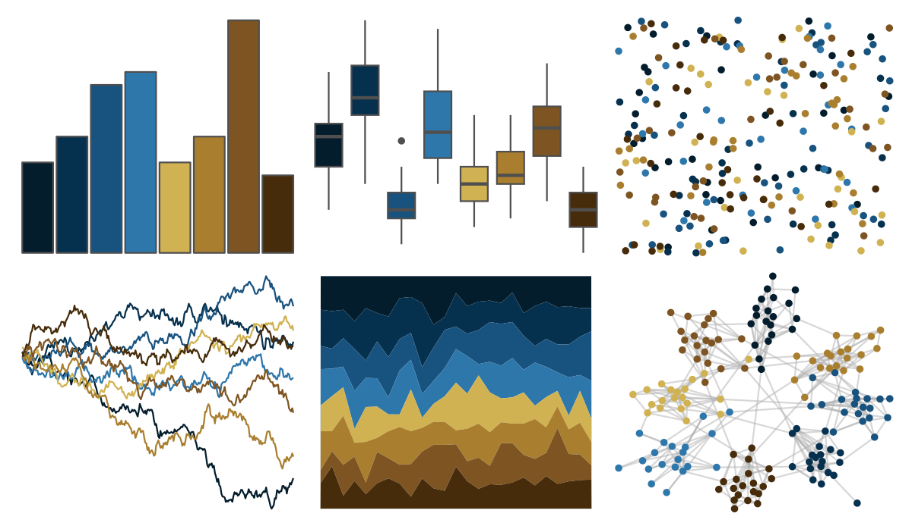

# MetBrewer - Ingres 

::: columns
::: {.column width="50%"}

**Github**

[BlakeRMills/MetBrewer](https://github.com/BlakeRMills/MetBrewer)
:::

::: {.column width="50%"}

**CRAN**

[MetBrewer](https://CRAN.R-project.org/package=MetBrewer)
:::
:::

<hr> 

Use with [paletteer](https://emilhvitfeldt.github.io/paletteer/) package:

```r
library(paletteer)
paletteer_d("MetBrewer::Ingres")
```

Use raw:

```r
c("#041D2CFF", "#06314EFF", "#18527EFF", "#2E77ABFF", "#D1B252FF", "#A97F2FFF", "#7E5522FF", "#472C0BFF")
``` 

 

<br>

# Related Palettes

<div class="list" style="display: grid; grid-template-columns: auto auto auto;"> <figure class="figure">
<a href="../../awtools/a_palette/"> </a>
</figure> <figure class="figure">
<a href="../../nbapalettes/nuggets/"> </a>
</figure> <figure class="figure">
<a href="../../lisa/GretchenAlbrecht/"> </a>
</figure> <figure class="figure">
<a href="../../MetBrewer/Nattier/"> </a>
</figure> <figure class="figure">
<a href="../../lisa/PavelTchelitchew/"> </a>
</figure> <figure class="figure">
<a href="../../ggprism/muted_rainbow/"> </a>
</figure> <figure class="figure">
<a href="../../MetBrewer/Veronese/"> </a>
</figure> <figure class="figure">
<a href="../../rtist/vermeer/"> </a>
</figure> <figure class="figure">
<a href="../../beyonce/X40/"> </a>
</figure> <figure class="figure">
<a href="../../colRoz/capricorn/"> </a>
</figure> <figure class="figure">
<a href="../../MetBrewer/Tiepolo/"> </a>
</figure> <figure class="figure">
<a href="../../colRoz/m_horridus/"> </a>
</figure> 
</div>
