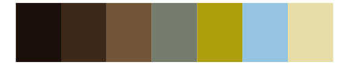

# MetBrewer - Isfahan1 

::: columns
::: {.column width="50%"}

**Github**

[BlakeRMills/MetBrewer](https://github.com/BlakeRMills/MetBrewer)
:::

::: {.column width="50%"}

**CRAN**

[MetBrewer](https://CRAN.R-project.org/package=MetBrewer)
:::
:::

<hr> 

Use with [paletteer](https://emilhvitfeldt.github.io/paletteer/) package:

```r
library(paletteer)
paletteer_d("MetBrewer::Isfahan1")
```

Use raw:

```r
c("#4E3910FF", "#845D29FF", "#AE8548FF", "#E3C28BFF", "#4FB6CAFF", "#178F92FF", "#175F5DFF", "#054544FF")
``` 

 

<br>

# Related Palettes

<div class="list" style="display: grid; grid-template-columns: auto auto auto;"> <figure class="figure">
<a href="../../awtools/a_palette/"> </a>
</figure> <figure class="figure">
<a href="../../ghibli/MarnieMedium1/"> </a>
</figure> <figure class="figure">
<a href="../../beyonce/X33/"> </a>
</figure> <figure class="figure">
<a href="../../beyonce/X40/"> </a>
</figure> <figure class="figure">
<a href="../../MetBrewer/Degas/"> </a>
</figure> <figure class="figure">
<a href="../../fishualize/Hamulon_plumieri/"> </a>
</figure> <figure class="figure">
<a href="../../MetBrewer/Tiepolo/"> </a>
</figure> <figure class="figure">
<a href="../../lisa/GiorgiodeChirico/"> </a>
</figure> <figure class="figure">
<a href="../../fishualize/Epinephelus_marginatus/"> </a>
</figure> <figure class="figure">
<a href="../../yarrr/ohbrother/"> </a>
</figure> <figure class="figure">
<a href="../../NatParksPalettes/Yellowstone/"> </a>
</figure> <figure class="figure">
<a href="../../fishualize/Histiophryne_psychedelica/"> </a>
</figure> 
</div>
