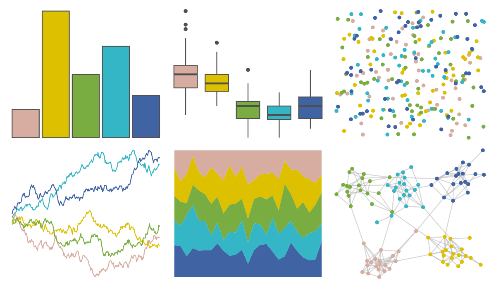

# MetBrewer - Isfahan2 

::: columns
::: {.column width="50%"}

**Github**

[BlakeRMills/MetBrewer](https://github.com/BlakeRMills/MetBrewer)
:::

::: {.column width="50%"}

**CRAN**

[MetBrewer](https://CRAN.R-project.org/package=MetBrewer)
:::
:::

<hr> 

Use with [paletteer](https://emilhvitfeldt.github.io/paletteer/) package:

```r
library(paletteer)
paletteer_d("MetBrewer::Isfahan2")
```

Use raw:

```r
c("#D7ACA1FF", "#DDC000FF", "#79AD41FF", "#34B6C6FF", "#4063A3FF")
``` 

 

<br>

# Related Palettes

<div class="list" style="display: grid; grid-template-columns: auto auto auto;"> <figure class="figure">
<a href="../../awtools/a_palette/"> </a>
</figure> <figure class="figure">
<a href="../../ButterflyColors/hamadryas_feronia/"> </a>
</figure> <figure class="figure">
<a href="../../ButterflyColors/hamadryas_feronia/"> </a>
</figure> <figure class="figure">
<a href="../../lisa/PabloPicasso_1/"> </a>
</figure> <figure class="figure">
<a href="../../rtist/picasso/"> </a>
</figure> <figure class="figure">
<a href="../../feathers/eastern_rosella/"> </a>
</figure> <figure class="figure">
<a href="../../fishualize/Ctenochaetus_strigosus/"> </a>
</figure> <figure class="figure">
<a href="../../ggthemes/Classic_Green_Orange_6/"> </a>
</figure> <figure class="figure">
<a href="../../fishualize/Sparisoma_viride/"> </a>
</figure> <figure class="figure">
<a href="../../fishualize/Valenciennea_strigata/"> </a>
</figure> <figure class="figure">
<a href="../../jcolors/pal9/"> </a>
</figure> <figure class="figure">
<a href="../../lisa/VincentvanGogh_1/"> </a>
</figure> 
</div>
