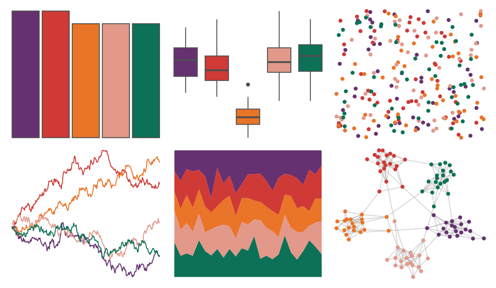

# MetBrewer - Java 

::: columns
::: {.column width="50%"}

**Github**

[BlakeRMills/MetBrewer](https://github.com/BlakeRMills/MetBrewer)
:::

::: {.column width="50%"}

**CRAN**

[MetBrewer](https://CRAN.R-project.org/package=MetBrewer)
:::
:::

<hr> 

Use with [paletteer](https://emilhvitfeldt.github.io/paletteer/) package:

```r
library(paletteer)
paletteer_d("MetBrewer::Java")
```

Use raw:

```r
c("#663171FF", "#CF3A36FF", "#EA7428FF", "#E2998AFF", "#0C7156FF")
``` 

 

<br>

# Related Palettes

<div class="list" style="display: grid; grid-template-columns: auto auto auto;"> <figure class="figure">
<a href="../../awtools/a_palette/"> </a>
</figure> <figure class="figure">
<a href="../../PNWColors/Sunset2/"> </a>
</figure> <figure class="figure">
<a href="../../colRoz/m_horridus/"> </a>
</figure> <figure class="figure">
<a href="../../colRoz/c_brevi/"> </a>
</figure> <figure class="figure">
<a href="../../NatParksPalettes/DeathValley/"> </a>
</figure> <figure class="figure">
<a href="../../nbapalettes/pelicans_city/"> </a>
</figure> <figure class="figure">
<a href="../../fishualize/Paranthias_furcifer/"> </a>
</figure> <figure class="figure">
<a href="../../lisa/Masaccio/"> </a>
</figure> <figure class="figure">
<a href="../../nbapalettes/blazers_city/"> </a>
</figure> <figure class="figure">
<a href="../../trekcolors/lcars_2375/"> </a>
</figure> <figure class="figure">
<a href="../../fishualize/Serranus_scriba/"> </a>
</figure> <figure class="figure">
<a href="../../ggthemes/excel_Aspect/"> </a>
</figure> 
</div>
