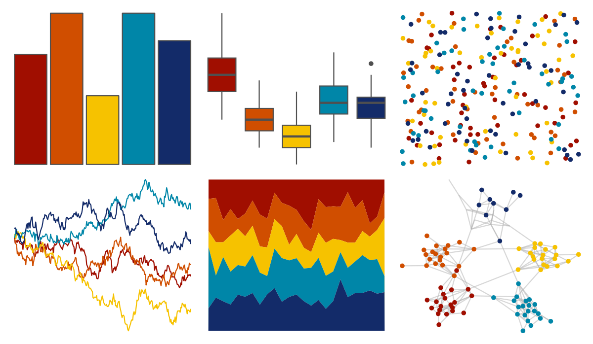

# MetBrewer - Johnson 

::: columns
::: {.column width="50%"}

**Github**

[BlakeRMills/MetBrewer](https://github.com/BlakeRMills/MetBrewer)
:::

::: {.column width="50%"}

**CRAN**

[MetBrewer](https://CRAN.R-project.org/package=MetBrewer)
:::
:::

<hr> 

Use with [paletteer](https://emilhvitfeldt.github.io/paletteer/) package:

```r
library(paletteer)
paletteer_d("MetBrewer::Johnson")
```

Use raw:

```r
c("#A00E00FF", "#D04E00FF", "#F6C200FF", "#0086A8FF", "#132B69FF")
``` 

 

<br>

# Related Palettes

<div class="list" style="display: grid; grid-template-columns: auto auto auto;"> <figure class="figure">
<a href="../../amerika/Dem_Ind_Rep3/"> </a>
</figure> <figure class="figure">
<a href="../../nbapalettes/thunder_city2/"> </a>
</figure> <figure class="figure">
<a href="../../MoMAColors/OKeeffe/"> </a>
</figure> <figure class="figure">
<a href="../../suffrager/london/"> </a>
</figure> <figure class="figure">
<a href="../../PNWColors/Bay/"> </a>
</figure> <figure class="figure">
<a href="../../nbapalettes/blazers_city/"> </a>
</figure> <figure class="figure">
<a href="../../nbapalettes/thunder/"> </a>
</figure> <figure class="figure">
<a href="../../MetBrewer/Juarez/"> </a>
</figure> <figure class="figure">
<a href="../../soilpalettes/redox2/"> </a>
</figure> <figure class="figure">
<a href="../../ggthemes/excel_Slice/"> </a>
</figure> <figure class="figure">
<a href="../../PrettyCols/Disco/"> </a>
</figure> <figure class="figure">
<a href="../../calecopal/kelp1/"> </a>
</figure> 
</div>
