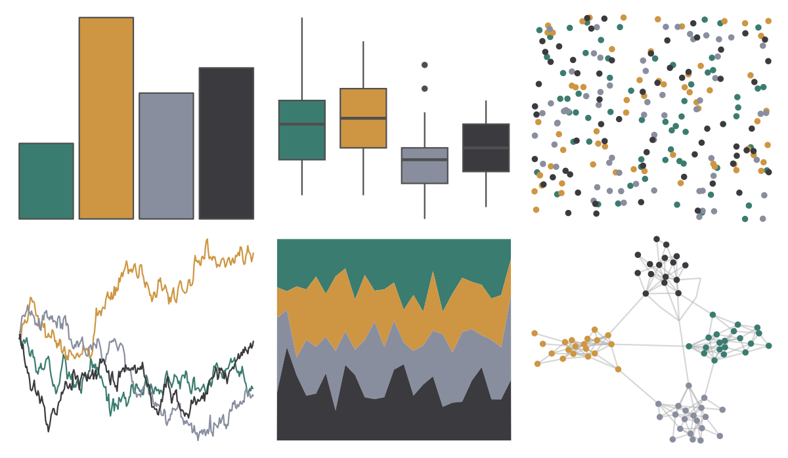

# MetBrewer - Kandinsky 

::: columns
::: {.column width="50%"}

**Github**

[BlakeRMills/MetBrewer](https://github.com/BlakeRMills/MetBrewer)
:::

::: {.column width="50%"}

**CRAN**

[MetBrewer](https://CRAN.R-project.org/package=MetBrewer)
:::
:::

<hr> 

Use with [paletteer](https://emilhvitfeldt.github.io/paletteer/) package:

```r
library(paletteer)
paletteer_d("MetBrewer::Kandinsky")
```

Use raw:

```r
c("#3B7C70FF", "#CE9642FF", "#898E9FFF", "#3B3A3EFF")
``` 

 

<br>

# Related Palettes

<div class="list" style="display: grid; grid-template-columns: auto auto auto;"> <figure class="figure">
<a href="../../awtools/a_palette/"> </a>
</figure> <figure class="figure">
<a href="../../fishualize/Oncorhynchus_gorbuscha/"> </a>
</figure> <figure class="figure">
<a href="../../NatParksPalettes/CraterLake/"> </a>
</figure> <figure class="figure">
<a href="../../rockthemes/melloncollie/"> </a>
</figure> <figure class="figure">
<a href="../../calecopal/sierra1/"> </a>
</figure> <figure class="figure">
<a href="../../fishualize/Stegastes_nigricans/"> </a>
</figure> <figure class="figure">
<a href="../../severance/Jazz02/"> </a>
</figure> <figure class="figure">
<a href="../../lisa/GeorgesSeurat/"> </a>
</figure> <figure class="figure">
<a href="../../beyonce/X6/"> </a>
</figure> <figure class="figure">
<a href="../../lisa/C_M_Coolidge/"> </a>
</figure> <figure class="figure">
<a href="../../IslamicArt/alhambra/"> </a>
</figure> <figure class="figure">
<a href="../../lisa/Michelangelo/"> </a>
</figure> 
</div>
