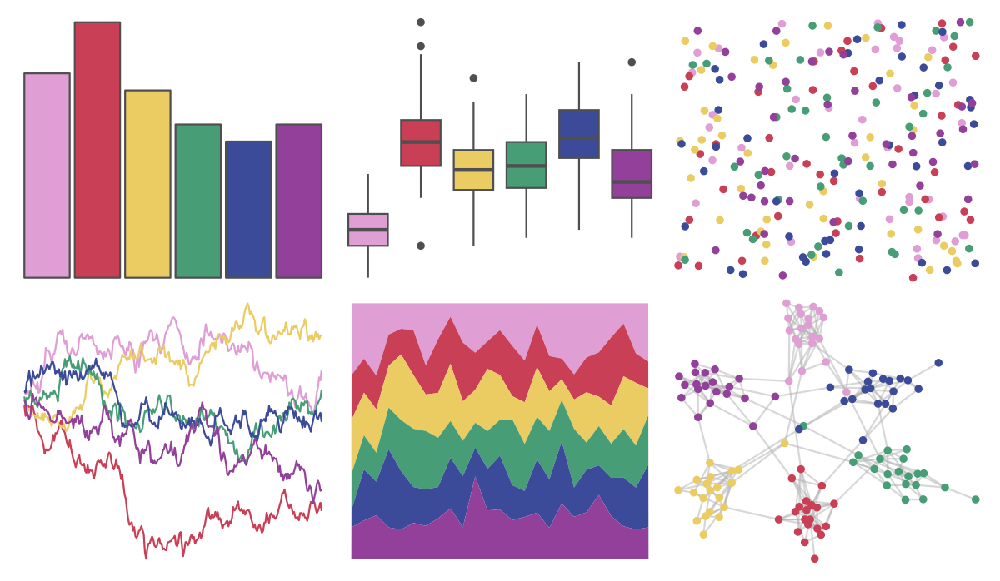

# MetBrewer - Klimt 

::: columns
::: {.column width="50%"}

**Github**

[BlakeRMills/MetBrewer](https://github.com/BlakeRMills/MetBrewer)
:::

::: {.column width="50%"}

**CRAN**

[MetBrewer](https://CRAN.R-project.org/package=MetBrewer)
:::
:::

<hr> 

Use with [paletteer](https://emilhvitfeldt.github.io/paletteer/) package:

```r
library(paletteer)
paletteer_d("MetBrewer::Klimt")
```

Use raw:

```r
c("#DF9ED4FF", "#C93F55FF", "#EACC62FF", "#469D76FF", "#3C4B99FF", "#924099FF")
``` 

 

<br>

# Related Palettes

<div class="list" style="display: grid; grid-template-columns: auto auto auto;"> <figure class="figure">
<a href="../../awtools/a_palette/"> </a>
</figure> <figure class="figure">
<a href="../../ButterflyColors/hamadryas_feronia/"> </a>
</figure> <figure class="figure">
<a href="../../ButterflyColors/hamadryas_feronia/"> </a>
</figure> <figure class="figure">
<a href="../../lisa/WassilyKandinsky_2/"> </a>
</figure> <figure class="figure">
<a href="../../khroma/muted/"> </a>
</figure> <figure class="figure">
<a href="../../fishualize/Oncorhynchus_nerka/"> </a>
</figure> <figure class="figure">
<a href="../../lisa/JamesRosenquist/"> </a>
</figure> <figure class="figure">
<a href="../../PrettyCols/Joyful/"> </a>
</figure> <figure class="figure">
<a href="../../werpals/alice/"> </a>
</figure> <figure class="figure">
<a href="../../tvthemes/SmokyQuartz/"> </a>
</figure> <figure class="figure">
<a href="../../vapoRwave/hyperBubble/"> </a>
</figure> <figure class="figure">
<a href="../../MetBrewer/Thomas/"> </a>
</figure> 
</div>
