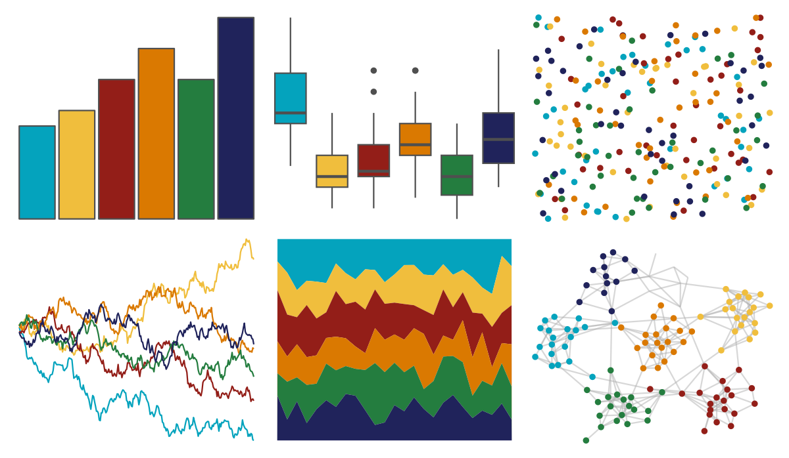

# MetBrewer - Lakota 

::: columns
::: {.column width="50%"}

**Github**

[BlakeRMills/MetBrewer](https://github.com/BlakeRMills/MetBrewer)
:::

::: {.column width="50%"}

**CRAN**

[MetBrewer](https://CRAN.R-project.org/package=MetBrewer)
:::
:::

<hr> 

Use with [paletteer](https://emilhvitfeldt.github.io/paletteer/) package:

```r
library(paletteer)
paletteer_d("MetBrewer::Lakota")
```

Use raw:

```r
c("#04A3BDFF", "#F0BE3DFF", "#931E18FF", "#DA7901FF", "#247D3FFF", "#20235BFF")
``` 

 

<br>

# Related Palettes

<div class="list" style="display: grid; grid-template-columns: auto auto auto;"> <figure class="figure">
<a href="../../amerika/Dem_Ind_Rep3/"> </a>
</figure> <figure class="figure">
<a href="../../werpals/small_world/"> </a>
</figure> <figure class="figure">
<a href="../../MetBrewer/Juarez/"> </a>
</figure> <figure class="figure">
<a href="../../fishualize/Balistapus_undulatus/"> </a>
</figure> <figure class="figure">
<a href="../../calecopal/kelp1/"> </a>
</figure> <figure class="figure">
<a href="../../fishualize/Scarus_tricolor/"> </a>
</figure> <figure class="figure">
<a href="../../feathers/bee_eater/"> </a>
</figure> <figure class="figure">
<a href="../../fishualize/Anisotremus_virginicus/"> </a>
</figure> <figure class="figure">
<a href="../../lisa/PavelTchelitchew/"> </a>
</figure> <figure class="figure">
<a href="../../colRoz/virgo/"> </a>
</figure> <figure class="figure">
<a href="../../tvthemes/CrazyLaceAgate/"> </a>
</figure> <figure class="figure">
<a href="../../khroma/mediumcontrast/"> </a>
</figure> 
</div>
