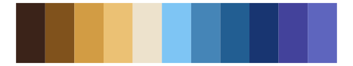
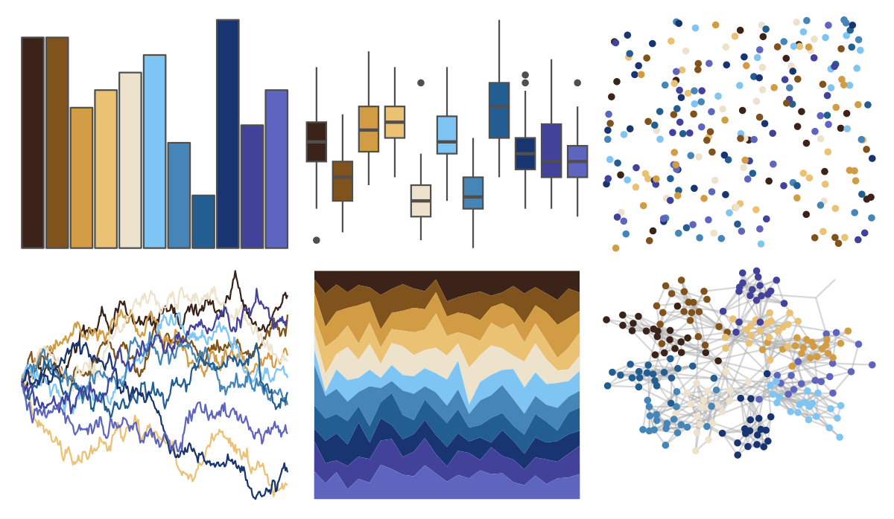
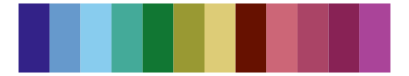

# MetBrewer - Manet 

::: columns
::: {.column width="50%"}

**Github**

[BlakeRMills/MetBrewer](https://github.com/BlakeRMills/MetBrewer)
:::

::: {.column width="50%"}

**CRAN**

[MetBrewer](https://CRAN.R-project.org/package=MetBrewer)
:::
:::

<hr> 

Use with [paletteer](https://emilhvitfeldt.github.io/paletteer/) package:

```r
library(paletteer)
paletteer_d("MetBrewer::Manet")
```

Use raw:

```r
c("#3B2319FF", "#80521CFF", "#D29C44FF", "#EBC174FF", "#EDE2CCFF", "#7EC5F4FF", "#4585B7FF", "#225E92FF", "#183571FF", "#43429BFF", "#5E65BEFF")
``` 

 

<br>

# Related Palettes

<div class="list" style="display: grid; grid-template-columns: auto auto auto;"> <figure class="figure">
<a href="../../amerika/Dem_Ind_Rep3/"> </a>
</figure> <figure class="figure">
<a href="../../nationalparkcolors/GeneralGrant/"> </a>
</figure> <figure class="figure">
<a href="../../pals/tol/"> </a>
</figure> <figure class="figure">
<a href="../../palettetown/swampert/"> </a>
</figure> <figure class="figure">
<a href="../../MetBrewer/OKeeffe1/"> </a>
</figure> <figure class="figure">
<a href="../../beyonce/X2/"> </a>
</figure> <figure class="figure">
<a href="../../LaCroixColoR/Pamplemousse/"> </a>
</figure> <figure class="figure">
<a href="../../dutchmasters/milkmaid/"> </a>
</figure> <figure class="figure">
<a href="../../ghibli/SpiritedMedium/"> </a>
</figure> <figure class="figure">
<a href="../../MetBrewer/Renoir/"> </a>
</figure> <figure class="figure">
<a href="../../werpals/uyuni/"> </a>
</figure> <figure class="figure">
<a href="../../MoMAColors/Rattner/"> </a>
</figure> 
</div>
