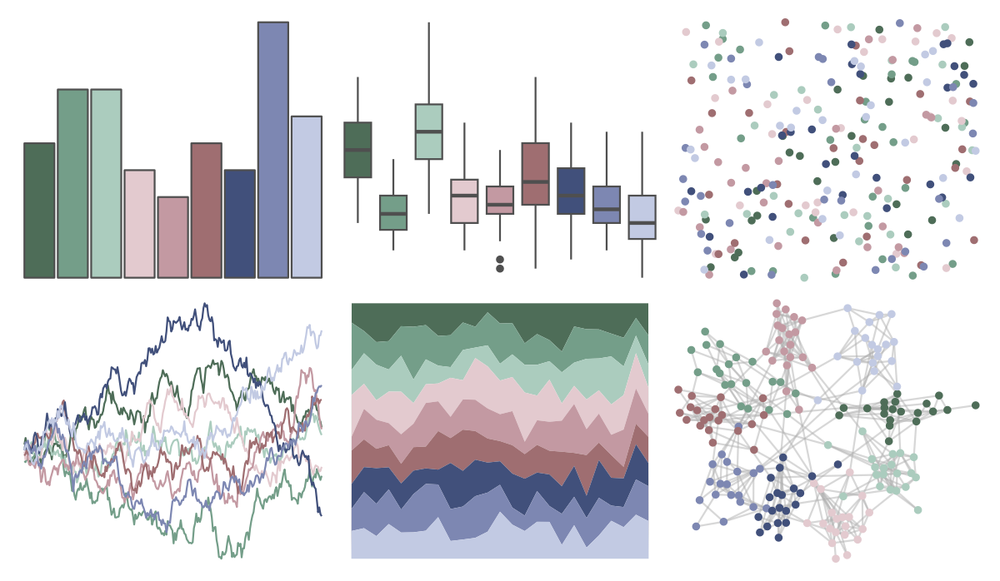
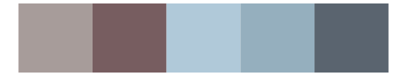

# MetBrewer - Monet 

::: columns
::: {.column width="50%"}

**Github**

[BlakeRMills/MetBrewer](https://github.com/BlakeRMills/MetBrewer)
:::

::: {.column width="50%"}

**CRAN**

[MetBrewer](https://CRAN.R-project.org/package=MetBrewer)
:::
:::

<hr> 

Use with [paletteer](https://emilhvitfeldt.github.io/paletteer/) package:

```r
library(paletteer)
paletteer_d("MetBrewer::Monet")
```

Use raw:

```r
c("#4E6D58FF", "#749E89FF", "#ABCCBEFF", "#E3CACFFF", "#C399A2FF", "#9F6E71FF", "#41507BFF", "#7D87B2FF", "#C2CAE3FF")
``` 

 

<br>

# Related Palettes

<div class="list" style="display: grid; grid-template-columns: auto auto auto;"> <figure class="figure">
<a href="../../amerika/Dem_Ind_Rep3/"> </a>
</figure> <figure class="figure">
<a href="../../calecopal/lupinus/"> </a>
</figure> <figure class="figure">
<a href="../../nord/afternoon_prarie/"> </a>
</figure> <figure class="figure">
<a href="../../MoMAColors/Levine2/"> </a>
</figure> <figure class="figure">
<a href="../../palettetown/dewgong/"> </a>
</figure> <figure class="figure">
<a href="../../palettetown/grimer/"> </a>
</figure> <figure class="figure">
<a href="../../fishualize/Opisthonema_oglinum/"> </a>
</figure> <figure class="figure">
<a href="../../fishualize/Mycteroperca_bonaci/"> </a>
</figure> <figure class="figure">
<a href="../../vangogh/Landscape/"> </a>
</figure> <figure class="figure">
<a href="../../palettetown/poliwrath/"> </a>
</figure> <figure class="figure">
<a href="../../nord/baie_mouton/"> </a>
</figure> <figure class="figure">
<a href="../../palettetown/steelix/"> </a>
</figure> 
</div>
