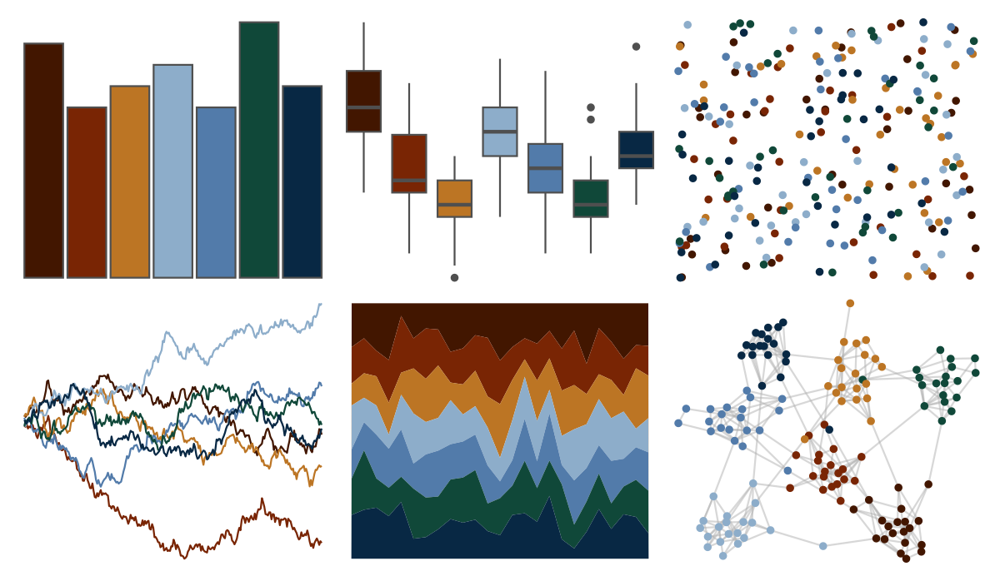

# MetBrewer - Moreau 

::: columns
::: {.column width="50%"}

**Github**

[BlakeRMills/MetBrewer](https://github.com/BlakeRMills/MetBrewer)
:::

::: {.column width="50%"}

**CRAN**

[MetBrewer](https://CRAN.R-project.org/package=MetBrewer)
:::
:::

<hr> 

Use with [paletteer](https://emilhvitfeldt.github.io/paletteer/) package:

```r
library(paletteer)
paletteer_d("MetBrewer::Moreau")
```

Use raw:

```r
c("#421600FF", "#792504FF", "#BC7524FF", "#8DADCAFF", "#527BAAFF", "#104839FF", "#082844FF")
``` 

 

<br>

# Related Palettes

<div class="list" style="display: grid; grid-template-columns: auto auto auto;"> <figure class="figure">
<a href="../../awtools/a_palette/"> </a>
</figure> <figure class="figure">
<a href="../../peRReo/badbunny1/"> </a>
</figure> <figure class="figure">
<a href="../../MetBrewer/Veronese/"> </a>
</figure> <figure class="figure">
<a href="../../NatParksPalettes/Triglav/"> </a>
</figure> <figure class="figure">
<a href="../../Manu/Tui/"> </a>
</figure> <figure class="figure">
<a href="../../MetBrewer/Troy/"> </a>
</figure> <figure class="figure">
<a href="../../beyonce/X38/"> </a>
</figure> <figure class="figure">
<a href="../../calecopal/superbloom3/"> </a>
</figure> <figure class="figure">
<a href="../../colRoz/m_horridus/"> </a>
</figure> <figure class="figure">
<a href="../../nbapalettes/bobcats/"> </a>
</figure> <figure class="figure">
<a href="../../ggthemr/solarized/"> </a>
</figure> <figure class="figure">
<a href="../../ggprism/muted_rainbow/"> </a>
</figure> 
</div>
