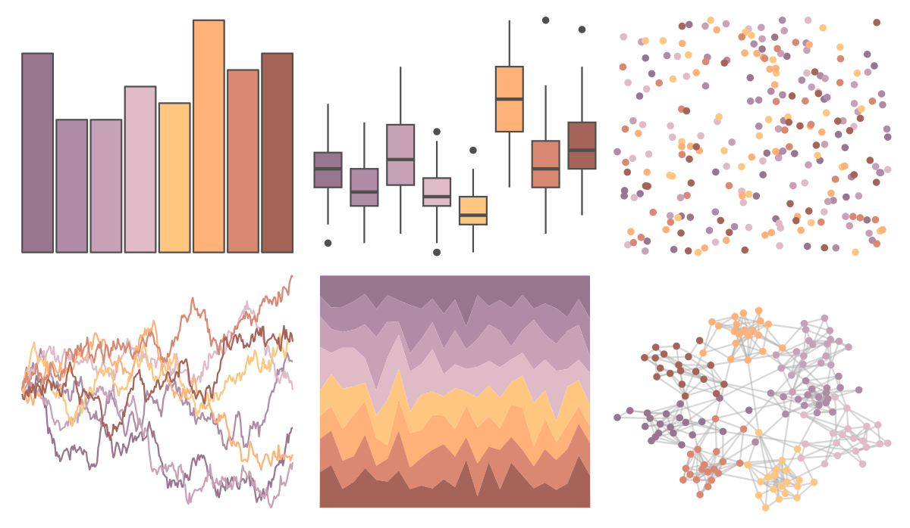

# MetBrewer - Morgenstern 

::: columns
::: {.column width="50%"}

**Github**

[BlakeRMills/MetBrewer](https://github.com/BlakeRMills/MetBrewer)
:::

::: {.column width="50%"}

**CRAN**

[MetBrewer](https://CRAN.R-project.org/package=MetBrewer)
:::
:::

<hr> 

Use with [paletteer](https://emilhvitfeldt.github.io/paletteer/) package:

```r
library(paletteer)
paletteer_d("MetBrewer::Morgenstern")
```

Use raw:

```r
c("#98768EFF", "#B08BA5FF", "#C7A2B6FF", "#DFBBC8FF", "#FFC680FF", "#FFB178FF", "#DB8872FF", "#A56457FF")
``` 

 

<br>

# Related Palettes

<div class="list" style="display: grid; grid-template-columns: auto auto auto;"> <figure class="figure">
<a href="../../awtools/a_palette/"> </a>
</figure> <figure class="figure">
<a href="../../ButterflyColors/hamadryas_feronia/"> </a>
</figure> <figure class="figure">
<a href="../../ButterflyColors/hamadryas_feronia/"> </a>
</figure> <figure class="figure">
<a href="../../trekcolors/lcars_2369/"> </a>
</figure> <figure class="figure">
<a href="../../rcartocolor/RedOr/"> </a>
</figure> <figure class="figure">
<a href="../../Redmonder/sPBIRd/"> </a>
</figure> <figure class="figure">
<a href="../../trekcolors/lcars_first_contact/"> </a>
</figure> <figure class="figure">
<a href="../../PNWColors/Spring/"> </a>
</figure> <figure class="figure">
<a href="../../lisa/JohnSingerSargent_2/"> </a>
</figure> <figure class="figure">
<a href="../../PNWColors/Sunset/"> </a>
</figure> <figure class="figure">
<a href="../../ggthemes/Winter/"> </a>
</figure> <figure class="figure">
<a href="../../calecopal/dudleya/"> </a>
</figure> 
</div>
