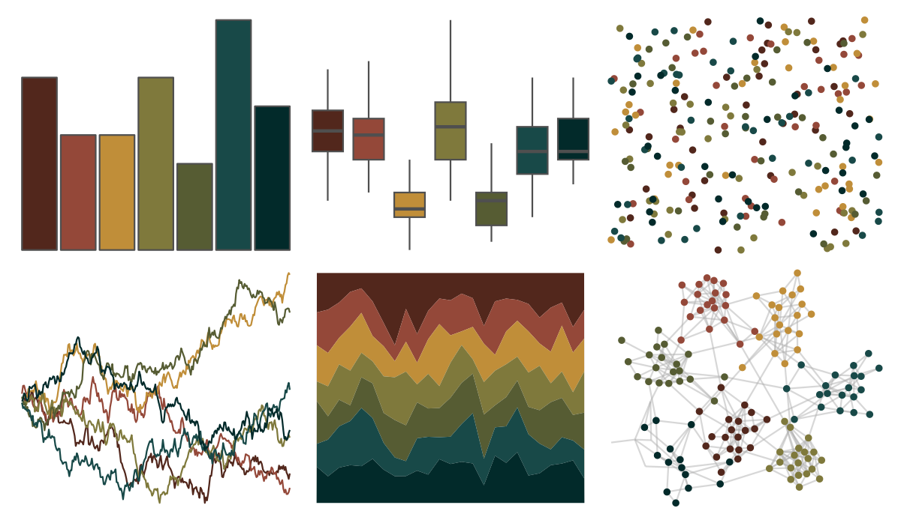

# MetBrewer - Nattier 

::: columns
::: {.column width="50%"}

**Github**

[BlakeRMills/MetBrewer](https://github.com/BlakeRMills/MetBrewer)
:::

::: {.column width="50%"}

**CRAN**

[MetBrewer](https://CRAN.R-project.org/package=MetBrewer)
:::
:::

<hr> 

Use with [paletteer](https://emilhvitfeldt.github.io/paletteer/) package:

```r
library(paletteer)
paletteer_d("MetBrewer::Nattier")
```

Use raw:

```r
c("#52271CFF", "#944839FF", "#C08E39FF", "#7F793CFF", "#565C33FF", "#184948FF", "#022A2AFF")
``` 

 

<br>

# Related Palettes

<div class="list" style="display: grid; grid-template-columns: auto auto auto;"> <figure class="figure">
<a href="../../awtools/a_palette/"> </a>
</figure> <figure class="figure">
<a href="../../MetBrewer/Gauguin/"> </a>
</figure> <figure class="figure">
<a href="../../MetBrewer/Degas/"> </a>
</figure> <figure class="figure">
<a href="../../colRoz/a_conica/"> </a>
</figure> <figure class="figure">
<a href="../../ggprism/greenwash/"> </a>
</figure> <figure class="figure">
<a href="../../DresdenColor/turncoat/"> </a>
</figure> <figure class="figure">
<a href="../../MetBrewer/Veronese/"> </a>
</figure> <figure class="figure">
<a href="../../lisa/ClaudeMonet/"> </a>
</figure> <figure class="figure">
<a href="../../colRoz/desert_flood/"> </a>
</figure> <figure class="figure">
<a href="../../MetBrewer/Ingres/"> </a>
</figure> <figure class="figure">
<a href="../../beyonce/X102/"> </a>
</figure> <figure class="figure">
<a href="../../colRoz/m_horridus/"> </a>
</figure> 
</div>
