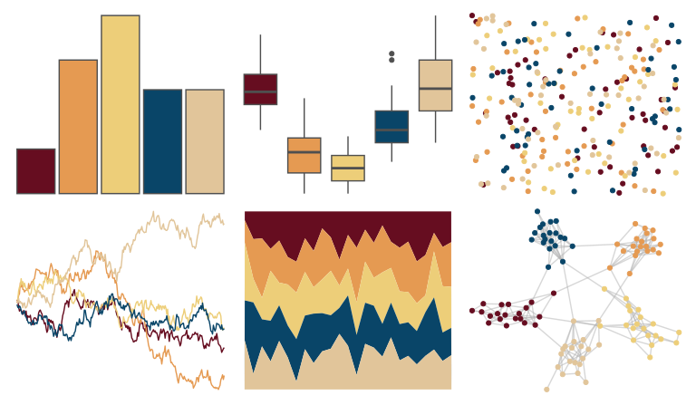

# MetBrewer - Navajo 

::: columns
::: {.column width="50%"}

**Github**

[BlakeRMills/MetBrewer](https://github.com/BlakeRMills/MetBrewer)
:::

::: {.column width="50%"}

**CRAN**

[MetBrewer](https://CRAN.R-project.org/package=MetBrewer)
:::
:::

<hr> 

Use with [paletteer](https://emilhvitfeldt.github.io/paletteer/) package:

```r
library(paletteer)
paletteer_d("MetBrewer::Navajo")
```

Use raw:

```r
c("#660D20FF", "#E59A52FF", "#EDCE79FF", "#094568FF", "#E1C59AFF")
``` 

 

<br>

# Related Palettes

<div class="list" style="display: grid; grid-template-columns: auto auto auto;"> <figure class="figure">
<a href="../../awtools/a_palette/"> </a>
</figure> <figure class="figure">
<a href="../../LaCroixColoR/Orange/"> </a>
</figure> <figure class="figure">
<a href="../../beyonce/X115/"> </a>
</figure> <figure class="figure">
<a href="../../futurevisions/grand_tour/"> </a>
</figure> <figure class="figure">
<a href="../../lisa/RoyLichtenstein_2/"> </a>
</figure> <figure class="figure">
<a href="../../soilpalettes/redox2/"> </a>
</figure> <figure class="figure">
<a href="../../jcolors/pal7/"> </a>
</figure> <figure class="figure">
<a href="../../lisa/PaulGauguin/"> </a>
</figure> <figure class="figure">
<a href="../../lisa/GeneDavis/"> </a>
</figure> <figure class="figure">
<a href="../../lisa/EdvardMunch/"> </a>
</figure> <figure class="figure">
<a href="../../PNWColors/Bay/"> </a>
</figure> <figure class="figure">
<a href="../../MetBrewer/Tiepolo/"> </a>
</figure> 
</div>
