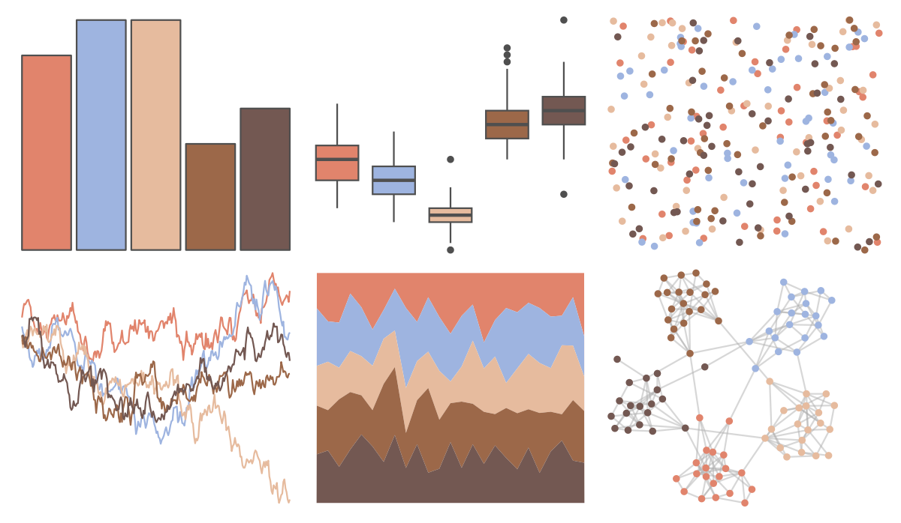

# MetBrewer - NewKingdom 

::: columns
::: {.column width="50%"}

**Github**

[BlakeRMills/MetBrewer](https://github.com/BlakeRMills/MetBrewer)
:::

::: {.column width="50%"}

**CRAN**

[MetBrewer](https://CRAN.R-project.org/package=MetBrewer)
:::
:::

<hr> 

Use with [paletteer](https://emilhvitfeldt.github.io/paletteer/) package:

```r
library(paletteer)
paletteer_d("MetBrewer::NewKingdom")
```

Use raw:

```r
c("#E1846CFF", "#9EB4E0FF", "#E6BB9EFF", "#9C6849FF", "#735852FF")
``` 

 

<br>

# Related Palettes

<div class="list" style="display: grid; grid-template-columns: auto auto auto;"> <figure class="figure">
<a href="../../awtools/a_palette/"> </a>
</figure> <figure class="figure">
<a href="../../ButterflyColors/hamadryas_feronia/"> </a>
</figure> <figure class="figure">
<a href="../../ButterflyColors/hamadryas_feronia/"> </a>
</figure> <figure class="figure">
<a href="../../calecopal/dudleya/"> </a>
</figure> <figure class="figure">
<a href="../../lisa/JohnSingerSargent_2/"> </a>
</figure> <figure class="figure">
<a href="../../yarrr/decision/"> </a>
</figure> <figure class="figure">
<a href="../../Redmonder/qMSOOrRd/"> </a>
</figure> <figure class="figure">
<a href="../../lisa/JeffKoons/"> </a>
</figure> <figure class="figure">
<a href="../../severance/Jazz01/"> </a>
</figure> <figure class="figure">
<a href="../../tvthemes/Day/"> </a>
</figure> <figure class="figure">
<a href="../../MoMAColors/Clay/"> </a>
</figure> <figure class="figure">
<a href="../../ButterflyColors/synargis_calyce/"> </a>
</figure> 
</div>
