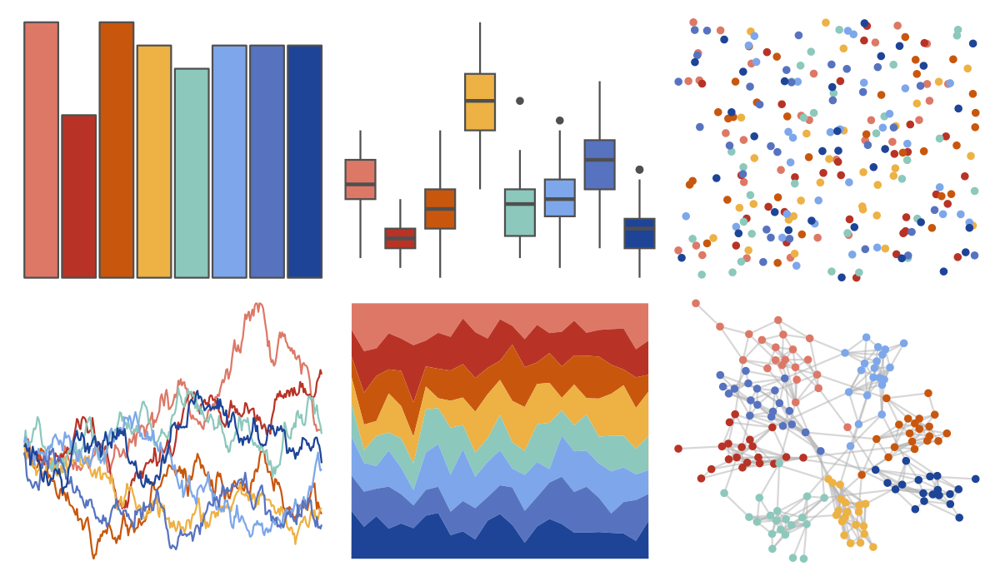

# MetBrewer - Nizami 

::: columns
::: {.column width="50%"}

**Github**

[BlakeRMills/MetBrewer](https://github.com/BlakeRMills/MetBrewer)
:::

::: {.column width="50%"}

**CRAN**

[MetBrewer](https://CRAN.R-project.org/package=MetBrewer)
:::
:::

<hr> 

Use with [paletteer](https://emilhvitfeldt.github.io/paletteer/) package:

```r
library(paletteer)
paletteer_d("MetBrewer::Nizami")
```

Use raw:

```r
c("#DD7867FF", "#B83326FF", "#C8570DFF", "#EDB144FF", "#8CC8BCFF", "#7DA7EAFF", "#5773C0FF", "#1D4497FF")
``` 

 

<br>

# Related Palettes

<div class="list" style="display: grid; grid-template-columns: auto auto auto;"> <figure class="figure">
<a href="../../awtools/a_palette/"> </a>
</figure> <figure class="figure">
<a href="../../fishualize/Lampris_guttatus/"> </a>
</figure> <figure class="figure">
<a href="../../fishualize/Pronotogrammus_martinicensis/"> </a>
</figure> <figure class="figure">
<a href="../../ggsci/nrc_npg/"> </a>
</figure> <figure class="figure">
<a href="../../trekcolors/lcars_nemesis/"> </a>
</figure> <figure class="figure">
<a href="../../MetBrewer/OKeeffe1/"> </a>
</figure> <figure class="figure">
<a href="../../MetBrewer/Hokusai1/"> </a>
</figure> <figure class="figure">
<a href="../../khroma/sunset/"> </a>
</figure> <figure class="figure">
<a href="../../ggthemes/Red_Blue_Brown/"> </a>
</figure> <figure class="figure">
<a href="../../tvthemes/CrazyLaceAgate/"> </a>
</figure> <figure class="figure">
<a href="../../LaCroixColoR/Pamplemousse/"> </a>
</figure> <figure class="figure">
<a href="../../Redmonder/qPBI/"> </a>
</figure> 
</div>
