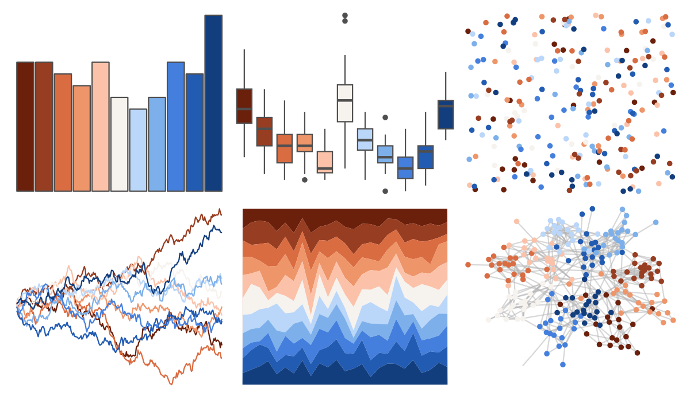

# MetBrewer - OKeeffe1 

::: columns
::: {.column width="50%"}

**Github**

[BlakeRMills/MetBrewer](https://github.com/BlakeRMills/MetBrewer)
:::

::: {.column width="50%"}

**CRAN**

[MetBrewer](https://CRAN.R-project.org/package=MetBrewer)
:::
:::

<hr> 

Use with [paletteer](https://emilhvitfeldt.github.io/paletteer/) package:

```r
library(paletteer)
paletteer_d("MetBrewer::OKeeffe1")
```

Use raw:

```r
c("#6B200CFF", "#973D21FF", "#DA6C42FF", "#EE956AFF", "#FBC2A9FF", "#F6F2EEFF", "#BAD6F9FF", "#7DB0EAFF", "#447FDDFF", "#225BB2FF", "#133E7EFF")
``` 

 

<br>

# Related Palettes

<div class="list" style="display: grid; grid-template-columns: auto auto auto;"> <figure class="figure">
<a href="../../amerika/Dem_Ind_Rep3/"> </a>
</figure> <figure class="figure">
<a href="../../NatParksPalettes/Arches/"> </a>
</figure> <figure class="figure">
<a href="../../RColorBrewer/RdBu/"> </a>
</figure> <figure class="figure">
<a href="../../palettetown/phanpy/"> </a>
</figure> <figure class="figure">
<a href="../../awtools/a_palette/"> </a>
</figure> <figure class="figure">
<a href="../../palettetown/totodile/"> </a>
</figure> <figure class="figure">
<a href="../../khroma/sunset/"> </a>
</figure> <figure class="figure">
<a href="../../MetBrewer/Nizami/"> </a>
</figure> <figure class="figure">
<a href="../../NatParksPalettes/Acadia/"> </a>
</figure> <figure class="figure">
<a href="../../RColorBrewer/RdYlBu/"> </a>
</figure> <figure class="figure">
<a href="../../MetBrewer/Manet/"> </a>
</figure> <figure class="figure">
<a href="../../futurevisions/grand_tour/"> </a>
</figure> 
</div>
