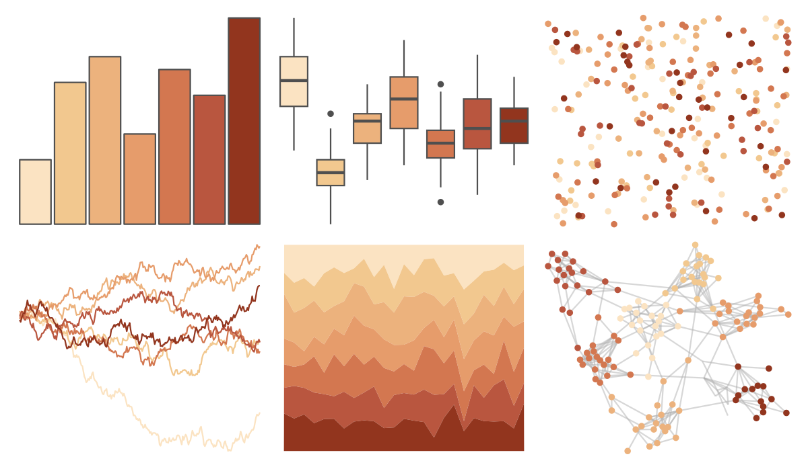

# MetBrewer - OKeeffe2 

::: columns
::: {.column width="50%"}

**Github**

[BlakeRMills/MetBrewer](https://github.com/BlakeRMills/MetBrewer)
:::

::: {.column width="50%"}

**CRAN**

[MetBrewer](https://CRAN.R-project.org/package=MetBrewer)
:::
:::

<hr> 

Use with [paletteer](https://emilhvitfeldt.github.io/paletteer/) package:

```r
library(paletteer)
paletteer_d("MetBrewer::OKeeffe2")
```

Use raw:

```r
c("#FBE3C2FF", "#F2C88FFF", "#ECB27DFF", "#E69C6BFF", "#D37750FF", "#B9563FFF", "#92351EFF")
``` 

 

<br>

# Related Palettes

<div class="list" style="display: grid; grid-template-columns: auto auto auto;"> <figure class="figure">
<a href="../../awtools/a_palette/"> </a>
</figure> <figure class="figure">
<a href="../../ButterflyColors/hamadryas_feronia/"> </a>
</figure> <figure class="figure">
<a href="../../ButterflyColors/hamadryas_feronia/"> </a>
</figure> <figure class="figure">
<a href="../../lisa/JohannJacobUlrich/"> </a>
</figure> <figure class="figure">
<a href="../../fishualize/Cantherhines_macrocerus/"> </a>
</figure> <figure class="figure">
<a href="../../calecopal/canary/"> </a>
</figure> <figure class="figure">
<a href="../../rcartocolor/OrYel/"> </a>
</figure> <figure class="figure">
<a href="../../colRoz/v_acanthurus/"> </a>
</figure> <figure class="figure">
<a href="../../RColorBrewer/OrRd/"> </a>
</figure> <figure class="figure">
<a href="../../miscpalettes/jojo/"> </a>
</figure> <figure class="figure">
<a href="../../waRhol/basquiat_85/"> </a>
</figure> <figure class="figure">
<a href="../../PNWColors/Mushroom/"> </a>
</figure> 
</div>
