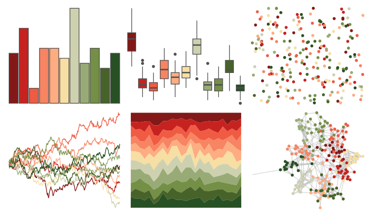

# MetBrewer - Paquin 

::: columns
::: {.column width="50%"}

**Github**

[BlakeRMills/MetBrewer](https://github.com/BlakeRMills/MetBrewer)
:::

::: {.column width="50%"}

**CRAN**

[MetBrewer](https://CRAN.R-project.org/package=MetBrewer)
:::
:::

<hr> 

Use with [paletteer](https://emilhvitfeldt.github.io/paletteer/) package:

```r
library(paletteer)
paletteer_d("MetBrewer::Paquin")
```

Use raw:

```r
c("#831818FF", "#C62320FF", "#F05B43FF", "#F78462FF", "#FEAC81FF", "#F7DEA3FF", "#CED1AFFF", "#98AB76FF", "#748F46FF", "#47632AFF", "#275024FF")
``` 

 

<br>

# Related Palettes

<div class="list" style="display: grid; grid-template-columns: auto auto auto;"> <figure class="figure">
<a href="../../awtools/a_palette/"> </a>
</figure> <figure class="figure">
<a href="../../ggthemes/Classic_Traffic_Light/"> </a>
</figure> <figure class="figure">
<a href="../../NatParksPalettes/SmokyMtns/"> </a>
</figure> <figure class="figure">
<a href="../../IslamicArt/fes/"> </a>
</figure> <figure class="figure">
<a href="../../trekcolors/tholian/"> </a>
</figure> <figure class="figure">
<a href="../../tvthemes/parksAndRec/"> </a>
</figure> <figure class="figure">
<a href="../../palettetown/pichu/"> </a>
</figure> <figure class="figure">
<a href="../../palettetown/dugtrio/"> </a>
</figure> <figure class="figure">
<a href="../../ggthemes/Traffic/"> </a>
</figure> <figure class="figure">
<a href="../../DresdenColor/skingame/"> </a>
</figure> <figure class="figure">
<a href="../../palettetown/magcargo/"> </a>
</figure> <figure class="figure">
<a href="../../palettetown/staryu/"> </a>
</figure> 
</div>
