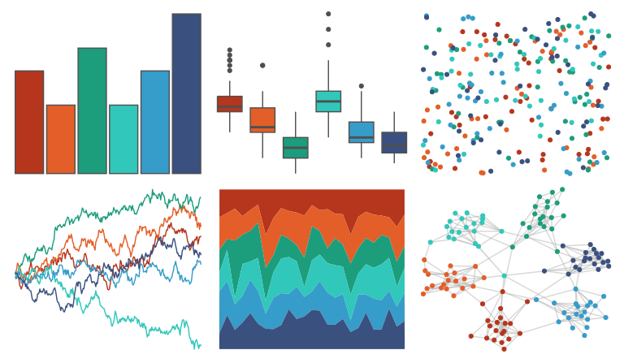

# MetBrewer - Peru1 

::: columns
::: {.column width="50%"}

**Github**

[BlakeRMills/MetBrewer](https://github.com/BlakeRMills/MetBrewer)
:::

::: {.column width="50%"}

**CRAN**

[MetBrewer](https://CRAN.R-project.org/package=MetBrewer)
:::
:::

<hr> 

Use with [paletteer](https://emilhvitfeldt.github.io/paletteer/) package:

```r
library(paletteer)
paletteer_d("MetBrewer::Peru1")
```

Use raw:

```r
c("#B5361CFF", "#E35E28FF", "#1C9D7CFF", "#31C7BAFF", "#369CC9FF", "#3A507FFF")
``` 

 

<br>

# Related Palettes

<div class="list" style="display: grid; grid-template-columns: auto auto auto;"> <figure class="figure">
<a href="../../awtools/a_palette/"> </a>
</figure> <figure class="figure">
<a href="../../fishualize/Lampris_guttatus/"> </a>
</figure> <figure class="figure">
<a href="../../fishualize/Odonus_niger/"> </a>
</figure> <figure class="figure">
<a href="../../palettetown/starterspairs/"> </a>
</figure> <figure class="figure">
<a href="../../MetBrewer/Nizami/"> </a>
</figure> <figure class="figure">
<a href="../../soilpalettes/redox/"> </a>
</figure> <figure class="figure">
<a href="../../fishualize/Hypsoblennius_invemar/"> </a>
</figure> <figure class="figure">
<a href="../../suffrager/oxon/"> </a>
</figure> <figure class="figure">
<a href="../../fishualize/Etheostoma_spectabile/"> </a>
</figure> <figure class="figure">
<a href="../../MetBrewer/Tiepolo/"> </a>
</figure> <figure class="figure">
<a href="../../colRoz/k_tristis/"> </a>
</figure> <figure class="figure">
<a href="../../beyonce/X40/"> </a>
</figure> 
</div>
