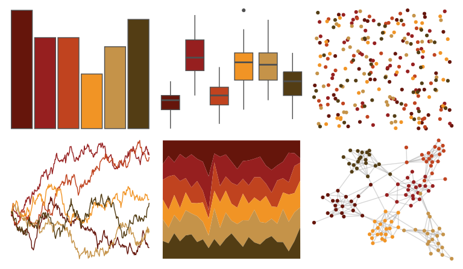

# MetBrewer - Peru2 

::: columns
::: {.column width="50%"}

**Github**

[BlakeRMills/MetBrewer](https://github.com/BlakeRMills/MetBrewer)
:::

::: {.column width="50%"}

**CRAN**

[MetBrewer](https://CRAN.R-project.org/package=MetBrewer)
:::
:::

<hr> 

Use with [paletteer](https://emilhvitfeldt.github.io/paletteer/) package:

```r
library(paletteer)
paletteer_d("MetBrewer::Peru2")
```

Use raw:

```r
c("#65150BFF", "#961F1FFF", "#C0431FFF", "#F19425FF", "#C59349FF", "#533D14FF")
``` 

 

<br>

# Related Palettes

<div class="list" style="display: grid; grid-template-columns: auto auto auto;"> <figure class="figure">
<a href="../../awtools/a_palette/"> </a>
</figure> <figure class="figure">
<a href="../../rockthemes/alice/"> </a>
</figure> <figure class="figure">
<a href="../../MetBrewer/Gauguin/"> </a>
</figure> <figure class="figure">
<a href="../../fishualize/Pseudupeneus_maculatus/"> </a>
</figure> <figure class="figure">
<a href="../../yarrr/rat/"> </a>
</figure> <figure class="figure">
<a href="../../nbapalettes/supersonics_90s/"> </a>
</figure> <figure class="figure">
<a href="../../fishualize/Pareiorhaphis_garbei/"> </a>
</figure> <figure class="figure">
<a href="../../miscpalettes/chocolate/"> </a>
</figure> <figure class="figure">
<a href="../../fishualize/Dermatolepis_inermis/"> </a>
</figure> <figure class="figure">
<a href="../../fishualize/Pleuronectes_platessa/"> </a>
</figure> <figure class="figure">
<a href="../../colRoz/v_pilbarensis/"> </a>
</figure> <figure class="figure">
<a href="../../nbapalettes/nuggets_city/"> </a>
</figure> 
</div>
