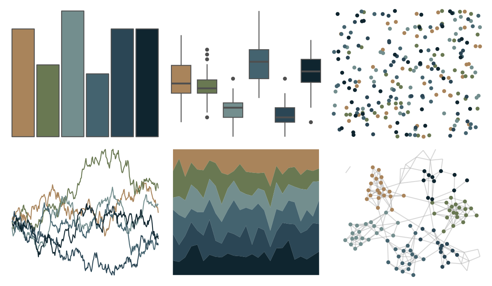

# MetBrewer - Pillement 

::: columns
::: {.column width="50%"}

**Github**

[BlakeRMills/MetBrewer](https://github.com/BlakeRMills/MetBrewer)
:::

::: {.column width="50%"}

**CRAN**

[MetBrewer](https://CRAN.R-project.org/package=MetBrewer)
:::
:::

<hr> 

Use with [paletteer](https://emilhvitfeldt.github.io/paletteer/) package:

```r
library(paletteer)
paletteer_d("MetBrewer::Pillement")
```

Use raw:

```r
c("#A9845BFF", "#697852FF", "#738E8EFF", "#44636FFF", "#2B4655FF", "#0F252FFF")
``` 

 

<br>

# Related Palettes

<div class="list" style="display: grid; grid-template-columns: auto auto auto;"> <figure class="figure">
<a href="../../awtools/a_palette/"> </a>
</figure> <figure class="figure">
<a href="../../NatParksPalettes/RockyMtn/"> </a>
</figure> <figure class="figure">
<a href="../../severance/Jazz02/"> </a>
</figure> <figure class="figure">
<a href="../../Manu/Putangitangi/"> </a>
</figure> <figure class="figure">
<a href="../../NatParksPalettes/CraterLake/"> </a>
</figure> <figure class="figure">
<a href="../../calecopal/sierra1/"> </a>
</figure> <figure class="figure">
<a href="../../beyonce/X1/"> </a>
</figure> <figure class="figure">
<a href="../../Manu/Kereru_orig/"> </a>
</figure> <figure class="figure">
<a href="../../beyonce/X47/"> </a>
</figure> <figure class="figure">
<a href="../../severance/Hell/"> </a>
</figure> <figure class="figure">
<a href="../../colRoz/c_azureus/"> </a>
</figure> <figure class="figure">
<a href="../../colRoz/salt_lake/"> </a>
</figure> 
</div>
