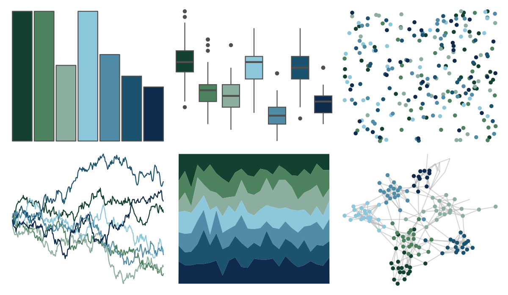

# MetBrewer - Pissaro 

::: columns
::: {.column width="50%"}

**Github**

[BlakeRMills/MetBrewer](https://github.com/BlakeRMills/MetBrewer)
:::

::: {.column width="50%"}

**CRAN**

[MetBrewer](https://CRAN.R-project.org/package=MetBrewer)
:::
:::

<hr> 

Use with [paletteer](https://emilhvitfeldt.github.io/paletteer/) package:

```r
library(paletteer)
paletteer_d("MetBrewer::Pissaro")
```

Use raw:

```r
c("#134130FF", "#4C825DFF", "#8CAE9EFF", "#8DC7DCFF", "#508CA7FF", "#1A5270FF", "#0E2A4DFF")
``` 

 

<br>

# Related Palettes

<div class="list" style="display: grid; grid-template-columns: auto auto auto;"> <figure class="figure">
<a href="../../awtools/a_palette/"> </a>
</figure> <figure class="figure">
<a href="../../MetBrewer/Hokusai2/"> </a>
</figure> <figure class="figure">
<a href="../../rockthemes/coltrane/"> </a>
</figure> <figure class="figure">
<a href="../../palettetown/pineco/"> </a>
</figure> <figure class="figure">
<a href="../../lisa/GeorgiaOKeeffe/"> </a>
</figure> <figure class="figure">
<a href="../../rtist/okeeffe/"> </a>
</figure> <figure class="figure">
<a href="../../severance/Dinner/"> </a>
</figure> <figure class="figure">
<a href="../../fishualize/Ostracion_whitleyi/"> </a>
</figure> <figure class="figure">
<a href="../../MetBrewer/VanGogh1/"> </a>
</figure> <figure class="figure">
<a href="../../rcartocolor/DarkMint/"> </a>
</figure> <figure class="figure">
<a href="../../calecopal/halfdome/"> </a>
</figure> <figure class="figure">
<a href="../../vapoRwave/jazzCup/"> </a>
</figure> 
</div>
