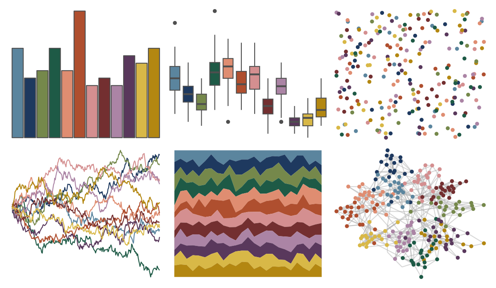
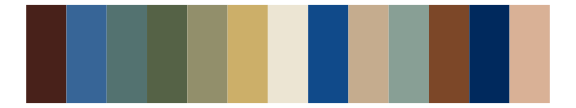

# MetBrewer - Redon 

::: columns
::: {.column width="50%"}

**Github**

[BlakeRMills/MetBrewer](https://github.com/BlakeRMills/MetBrewer)
:::

::: {.column width="50%"}

**CRAN**

[MetBrewer](https://CRAN.R-project.org/package=MetBrewer)
:::
:::

<hr> 

Use with [paletteer](https://emilhvitfeldt.github.io/paletteer/) package:

```r
library(paletteer)
paletteer_d("MetBrewer::Redon")
```

Use raw:

```r
c("#5B859EFF", "#1E395FFF", "#75884BFF", "#1E5A46FF", "#DF8D71FF", "#AF4F2FFF", "#D48F90FF", "#732F30FF", "#AB84A5FF", "#59385CFF", "#D8B847FF", "#B38711FF")
``` 

 

<br>

# Related Palettes

<div class="list" style="display: grid; grid-template-columns: auto auto auto;"> <figure class="figure">
<a href="../../amerika/Dem_Ind_Rep3/"> </a>
</figure> <figure class="figure">
<a href="../../MetBrewer/Demuth/"> </a>
</figure> <figure class="figure">
<a href="../../MetBrewer/Renoir/"> </a>
</figure> <figure class="figure">
<a href="../../futurevisions/pegasi/"> </a>
</figure> <figure class="figure">
<a href="../../NatParksPalettes/Torres/"> </a>
</figure> <figure class="figure">
<a href="../../DresdenColor/paired/"> </a>
</figure> <figure class="figure">
<a href="../../MetBrewer/Tiepolo/"> </a>
</figure> <figure class="figure">
<a href="../../dutchmasters/milkmaid/"> </a>
</figure> <figure class="figure">
<a href="../../MexBrewer/Atentado/"> </a>
</figure> <figure class="figure">
<a href="../../MetBrewer/Cross/"> </a>
</figure> <figure class="figure">
<a href="../../MetBrewer/Signac/"> </a>
</figure> <figure class="figure">
<a href="../../MoMAColors/Klein/"> </a>
</figure> 
</div>
