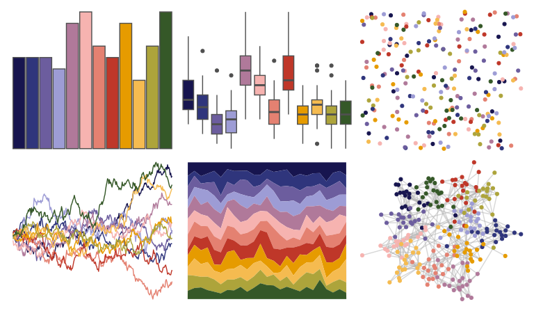

# MetBrewer - Renoir 

::: columns
::: {.column width="50%"}

**Github**

[BlakeRMills/MetBrewer](https://github.com/BlakeRMills/MetBrewer)
:::

::: {.column width="50%"}

**CRAN**

[MetBrewer](https://CRAN.R-project.org/package=MetBrewer)
:::
:::

<hr> 

Use with [paletteer](https://emilhvitfeldt.github.io/paletteer/) package:

```r
library(paletteer)
paletteer_d("MetBrewer::Renoir")
```

Use raw:

```r
c("#17154FFF", "#2F357CFF", "#6C5D9EFF", "#9D9CD5FF", "#B0799AFF", "#F6B3B0FF", "#E48171FF", "#BF3729FF", "#E69B00FF", "#F5BB50FF", "#ADA43BFF", "#355828FF")
``` 

 

<br>

# Related Palettes

<div class="list" style="display: grid; grid-template-columns: auto auto auto;"> <figure class="figure">
<a href="../../awtools/a_palette/"> </a>
</figure> <figure class="figure">
<a href="../../palettetown/starmie/"> </a>
</figure> <figure class="figure">
<a href="../../MetBrewer/Redon/"> </a>
</figure> <figure class="figure">
<a href="../../DresdenColor/paired/"> </a>
</figure> <figure class="figure">
<a href="../../MetBrewer/Signac/"> </a>
</figure> <figure class="figure">
<a href="../../rcartocolor/Bold/"> </a>
</figure> <figure class="figure">
<a href="../../MetBrewer/Cross/"> </a>
</figure> <figure class="figure">
<a href="../../jcolors/pal6/"> </a>
</figure> <figure class="figure">
<a href="../../RColorBrewer/PuOr/"> </a>
</figure> <figure class="figure">
<a href="../../palettetown/ekans/"> </a>
</figure> <figure class="figure">
<a href="../../peRReo/badbunny2/"> </a>
</figure> <figure class="figure">
<a href="../../dutchmasters/milkmaid/"> </a>
</figure> 
</div>
