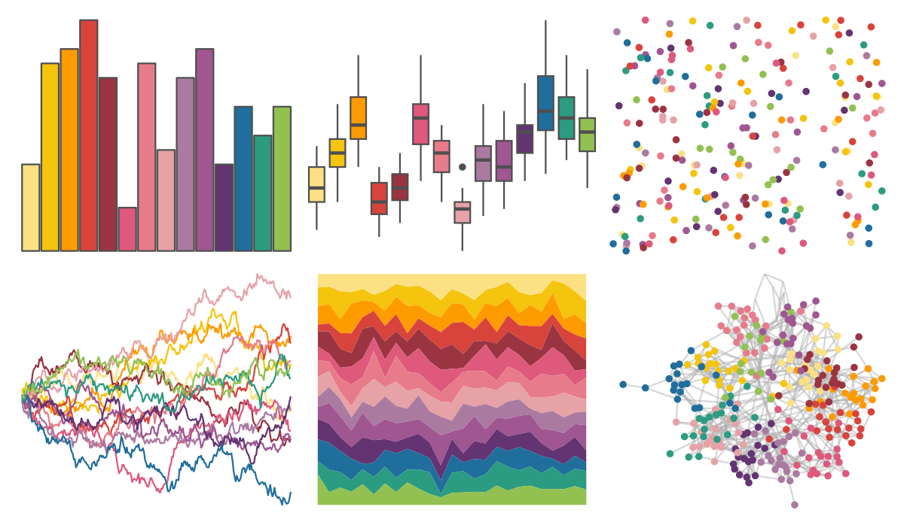

# MetBrewer - Signac 

::: columns
::: {.column width="50%"}

**Github**

[BlakeRMills/MetBrewer](https://github.com/BlakeRMills/MetBrewer)
:::

::: {.column width="50%"}

**CRAN**

[MetBrewer](https://CRAN.R-project.org/package=MetBrewer)
:::
:::

<hr> 

Use with [paletteer](https://emilhvitfeldt.github.io/paletteer/) package:

```r
library(paletteer)
paletteer_d("MetBrewer::Signac")
```

Use raw:

```r
c("#FBE183FF", "#F4C40FFF", "#FE9B00FF", "#D8443CFF", "#9B3441FF", "#DE597CFF", "#E87B89FF", "#E6A2A6FF", "#AA7AA1FF", "#9F5691FF", "#633372FF", "#1F6E9CFF", "#2B9B81FF", "#92C051FF")
``` 

 

<br>

# Related Palettes

<div class="list" style="display: grid; grid-template-columns: auto auto auto;"> <figure class="figure">
<a href="../../awtools/a_palette/"> </a>
</figure> <figure class="figure">
<a href="../../palettetown/starmie/"> </a>
</figure> <figure class="figure">
<a href="../../DresdenColor/paired/"> </a>
</figure> <figure class="figure">
<a href="../../rcartocolor/Bold/"> </a>
</figure> <figure class="figure">
<a href="../../MetBrewer/Renoir/"> </a>
</figure> <figure class="figure">
<a href="../../rcartocolor/Vivid/"> </a>
</figure> <figure class="figure">
<a href="../../ggthemes/stata_s2color/"> </a>
</figure> <figure class="figure">
<a href="../../palettetown/misdreavus/"> </a>
</figure> <figure class="figure">
<a href="../../ggthemes/Classic_Cyclic/"> </a>
</figure> <figure class="figure">
<a href="../../palettetown/ekans/"> </a>
</figure> <figure class="figure">
<a href="../../IslamicArt/shiraz/"> </a>
</figure> <figure class="figure">
<a href="../../tidyquant/tq_light/"> </a>
</figure> 
</div>
