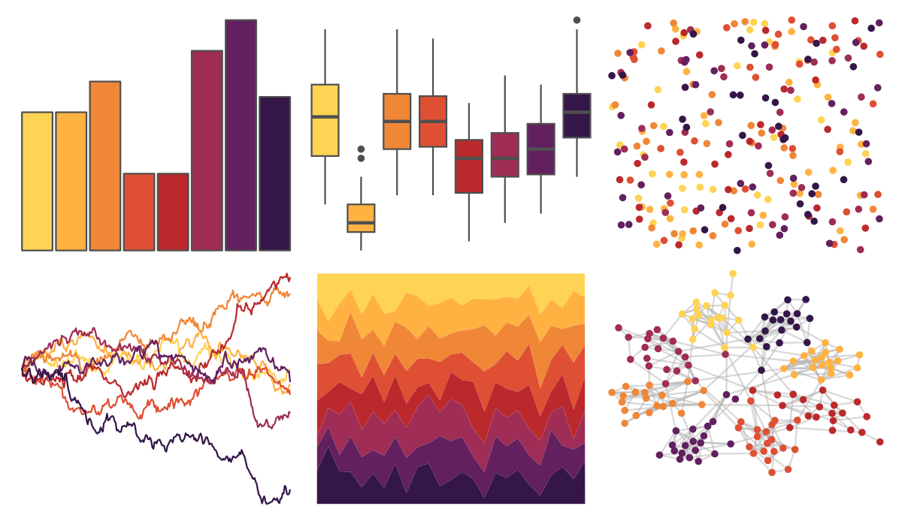

# MetBrewer - Tam 

::: columns
::: {.column width="50%"}

**Github**

[BlakeRMills/MetBrewer](https://github.com/BlakeRMills/MetBrewer)
:::

::: {.column width="50%"}

**CRAN**

[MetBrewer](https://CRAN.R-project.org/package=MetBrewer)
:::
:::

<hr> 

Use with [paletteer](https://emilhvitfeldt.github.io/paletteer/) package:

```r
library(paletteer)
paletteer_d("MetBrewer::Tam")
```

Use raw:

```r
c("#FFD353FF", "#FFB242FF", "#EF8737FF", "#DE4F33FF", "#BB292CFF", "#9F2D55FF", "#62205FFF", "#341648FF")
``` 

 

<br>

# Related Palettes

<div class="list" style="display: grid; grid-template-columns: auto auto auto;"> <figure class="figure">
<a href="../../awtools/a_palette/"> </a>
</figure> <figure class="figure">
<a href="../../peRReo/badbunny2/"> </a>
</figure> <figure class="figure">
<a href="../../MetBrewer/Archambault/"> </a>
</figure> <figure class="figure">
<a href="../../trekcolors/enara/"> </a>
</figure> <figure class="figure">
<a href="../../jcolors/pal4/"> </a>
</figure> <figure class="figure">
<a href="../../suffrager/london/"> </a>
</figure> <figure class="figure">
<a href="../../beyonce/X36/"> </a>
</figure> <figure class="figure">
<a href="../../colRoz/c_brevi/"> </a>
</figure> <figure class="figure">
<a href="../../nbapalettes/blazers_city/"> </a>
</figure> <figure class="figure">
<a href="../../NatParksPalettes/DeathValley/"> </a>
</figure> <figure class="figure">
<a href="../../nationalparkcolors/Hawaii/"> </a>
</figure> <figure class="figure">
<a href="../../NineteenEightyR/sunset3/"> </a>
</figure> 
</div>
